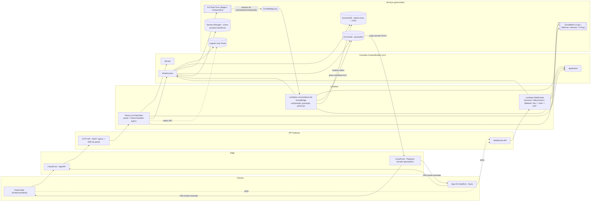

# Fase 1 — Arquitetura

Decisão de entrada (dada, não revisitada aqui): Next.js completo (painel + `/api/v1`)
empacotado em Lambda via `@opennextjs/aws`, atrás de API Gateway + CloudFront. Mais
Lambdas dedicadas para as rotas WebSocket e para os consumidores de EventBridge — essas
duas superfícies não são HTTP request/response e não cabem em Route Handlers. As três
superfícies compartilham `src/domain`, `src/application` e `src/infrastructure`.

## 1. Diagrama de arquitetura



**Por que três Lambdas e não uma só:** a Lambda do Next.js (OpenNext) responde a
eventos de API Gateway HTTP (request/response). As rotas WebSocket chegam como eventos
de API Gateway WebSocket (`$connect`, `$disconnect`, mensagens) com uma forma de evento
completamente diferente e um ciclo de vida de conexão que não existe em HTTP — não dá
para modelar como Route Handler. Os consumidores de EventBridge reagem a eventos
assíncronos do IVS (participante publicou, composição terminou) sem que exista uma
requisição HTTP em andamento. As três funções compartilham `domain`/`application`/
`infrastructure` para não duplicar regra de negócio nem acesso a dados — a diferença
entre elas é só a camada de entrada (adapter).

## 2. Fluxo de autenticação

Cognito é o único emissor de tokens (login, refresh, confirmação, recuperação de
senha). O backend nunca emite token de autenticação — ele só valida o que o Cognito
emitiu.

### Painel web (navegador)

1. O usuário faz login contra o Cognito (Hosted UI ou chamada direta ao
   `InitiateAuth`/`RespondToAuthChallenge` a partir de um Route Handler que atua como
   BFF — a decisão entre as duas fica em aberto, ver seção 8).
2. O Route Handler de sessão recebe `access_token`, `id_token` e `refresh_token` do
   Cognito e os grava como cookies `httpOnly`, `Secure`, `SameSite=Lax`. Tokens nunca
   tocam `localStorage`/JS do cliente — o painel é servido pelo próprio Next.js, então
   não há necessidade de expor o token ao browser.
3. Em cada requisição às páginas do painel ou a `/api/v1/*`, o middleware do Next.js
   lê o cookie do access token e delega a validação ao adapter de Cognito
   (`src/infrastructure/aws/cognito`): verifica assinatura via JWKS, `iss`, `aud`,
   expiração e `token_use = access`. O `sub` validado vira a identidade da requisição.
4. Perto da expiração, um Route Handler dedicado usa o refresh token (cookie) para
   chamar `InitiateAuth` com `REFRESH_TOKEN_AUTH` e rotaciona os cookies de access/id
   token. Falha no refresh → sessão encerrada, usuário redirecionado ao login.
5. Logout: apaga os cookies e, opcionalmente, chama `GlobalSignOut` no Cognito.

### App iOS (futuro)

1. O app autentica diretamente contra o Cognito (SRP via SDK/Amplify) e guarda os
   tokens no Keychain — nunca em `UserDefaults`.
2. Toda chamada a `/api/v1/*` carrega `Authorization: Bearer <access_token>`. Sem
   cookies: app nativo não compartilha cookie jar de browser, e Bearer evita a
   necessidade de proteção CSRF que cookies exigiriam.
3. O mesmo adapter de validação de JWT usado pelo painel é reutilizado aqui — a única
   diferença entre as duas superfícies é de onde o token é extraído (cookie vs.
   header), nunca como ele é validado.
4. Renovação: o app chama `InitiateAuth` com `REFRESH_TOKEN_AUTH` diretamente, sem
   depender de um Route Handler de sessão (não há cookie para rotacionar).

### Convergência

Ambas as superfícies produzem o mesmo `AuthenticatedRequestContext` (contendo `sub`,
depois enriquecido com `UserProfile.role` e `UserProfile.institutionId` buscados no
DynamoDB) antes de chegar aos casos de uso em `src/application`. Os casos de uso nunca
sabem se o request veio de cookie ou Bearer, e nunca confiam em uma role enviada no
corpo da requisição — a role vem sempre do registro de `UserProfile`, não do payload
do JWT nem do body.

## 3. Fluxo de entrada em uma live

`POST /api/v1/lives/{liveId}/join`, executado como Route Handler na Lambda Next.js.

```mermaid
sequenceDiagram
    participant C as Cliente (painel/iOS)
    participant API as Route Handler /join
    participant Auth as Cognito (validação JWT)
    participant DDB as DynamoDB
    participant IVS as IvsRealTimeService

    C->>API: POST /lives/{liveId}/join (Bearer ou cookie)
    API->>Auth: 1. valida assinatura, iss, aud, exp, token_use
    Auth-->>API: sub
    API->>DDB: GetItem UserProfile(sub)
    DDB-->>API: institutionId, role
    API->>DDB: GetItem LiveSession(PK=LIVE#{liveId}, SK=METADATA), ConsistentRead
    DDB-->>API: institutionId da live, classId, status
    API->>API: 2. institutionId do usuário == institutionId da live?
    API->>DDB: GetItem Enrollment(studentId, classId) [se ALUNO]
    DDB-->>API: 3. matrícula existe?
    API->>API: 4. status da live permite entrada? (janela + máquina de estados)
    API->>API: 5. qual a função efetiva: ADMIN / PROFESSOR (principal ou convidado) / ALUNO (comum ou promovido)?
    API->>API: 6. mapeia função -> capabilities IVS (sempre explícito, sempre inclui SUBSCRIBE)
    API->>DDB: PutItem LiveParticipant(liveId, userId) -> gera liveParticipantId (UUID opaco)
    API->>IVS: createParticipantToken(stageArn, userId=liveParticipantId, attributes={liveParticipantId, role}, capabilities, TTL curto)
    IVS-->>API: token temporário (nunca persistido, nunca logado; attributes/userId sem PII - ver nota abaixo)
    API-->>C: { live, participant, ivs, realtime }
```

As seis verificações, na ordem exata da seção 6 do README:

1. **Autenticado** — JWT válido (assinatura, `iss`, `aud`, `exp`, `token_use`); `sub`
   extraído.
2. **Pertence à instituição** — `UserProfile.institutionId` do requisitante precisa
   bater com o `institutionId` da `LiveSession` (que herda da `ClassGroup`/`Course`).
3. **Possui acesso ao curso/turma** — para `ALUNO`, existe `Enrollment` ativa na
   `ClassGroup` da live; para `PROFESSOR`, ele é o dono da turma ou está na lista de
   coapresentadores convidados.
4. **Live disponível** — estado atual permite entrada: `WAITING` ou `LIVE` sempre;
   `SCHEDULED` só dentro da janela configurada antes do horário; `ENDED`/`CANCELED`/
   `FAILED` nunca (seção 10).
5. **Função do participante** — `ADMIN`, `PROFESSOR` (principal ou coapresentador) ou
   `ALUNO` (comum ou temporariamente promovido — checado em `LiveParticipant`, não
   apenas no papel global do usuário).
6. **Capabilities do IVS** — mapeamento fixo da seção 6: professor principal e
   coapresentador → `PUBLISH`+`SUBSCRIBE`; aluno comum → `SUBSCRIBE`; aluno promovido →
   `PUBLISH`+`SUBSCRIBE`.

Depois das seis verificações, o token do IVS é criado com TTL curto, nunca é
persistido por inteiro nem aparece em log (apenas o `participantId` e metadados não
sensíveis podem ser logados). A resposta segue o DTO da seção 11 (`live` /
`participant` / `ivs` / `realtime`), incluindo a URL e o token de conexão do
WebSocket para chat/interações.

**Correção de segurança (verificada na doc oficial de `CreateParticipantToken`):**
`attributes` e `userId` do token IVS são expostos a **todos os participantes do
stage**, e a documentação é explícita — não devem conter "personally identifying,
confidential, or sensitive information". A seção 6 do README pede codificar
"usuário, live, função e instituição" no token; feito ao pé da letra (sub do
Cognito, institutionId), isso vaza esses dados para qualquer aluno da turma. Correção
adotada: `attributes`/`userId` carregam **somente o UUID opaco do `LiveParticipant`**
e a `role` — nunca `sub`, e-mail, nome, matrícula ou `institutionId`. O mapeamento
opaco → usuário real fica só no DynamoDB, do lado do servidor (o mesmo item
`LiveParticipant` que já guarda `capabilities`). "Identificar o usuário" (exigido
pela seção 6) passa a significar "o servidor consegue resolver quem é, via esse
UUID" — não "o token expõe quem é". Implementado em
`src/infrastructure/aws/ivs/participant-token-attributes.ts`, com teste que falha se
um campo sensível (por nome de chave ou por valor com cara de e-mail/JWT) entrar no
payload.

Limites confirmados na doc oficial de `CreateParticipantToken` (RealTimeAPIReference):
`capabilities` aceita 0–2 itens, valores válidos `PUBLISH`/`SUBSCRIBE`; `duration` de
1 a 20160 minutos, default 720 (12h); `attributes` até 1 KB total. **Detalhe que não
estava no desenho anterior:** se `capabilities` for omitido, o default da API é
`PUBLISH`+`SUBSCRIBE` — ou seja, esquecer de passar `capabilities` explicitamente dá
permissão de publicar a um aluno comum. Por isso a regra de negócio desta plataforma
é mais estrita que a API: `capabilities` é sempre explícito, nunca omitido, e sempre
inclui `SUBSCRIBE` (todo participante pode ao menos assistir).

## 4. Fluxo de múltiplos apresentadores

Promover e remover apresentadores nunca altera permissão permanente do usuário — o
efeito vive inteiramente dentro do escopo da live corrente (`LIVE#{liveId}`), nunca em
`UserProfile`.

```mermaid
sequenceDiagram
    participant P as Professor (dono da live)
    participant API as Route Handler /presenters/{userId}/promote
    participant DDB as DynamoDB
    participant IVS as IvsRealTimeService
    participant WS as API Gateway WebSocket
    participant U as Aluno promovido

    P->>API: POST /lives/{liveId}/presenters/{userId}/promote
    API->>API: professor é dono/coapresentador desta live?
    API->>DDB: GetItem LiveParticipant(liveId, userId)
    DDB-->>API: participante já está na live? (obrigatório) + liveParticipantId (UUID opaco)
    API->>DDB: UpdateItem capabilities=[PUBLISH,SUBSCRIBE], promotedAt=now
    API->>DDB: escreve entrada esparsa no GSI3 (índice de apresentadores ativos)
    API->>IVS: createParticipantToken(stageArn, userId=liveParticipantId, attributes={liveParticipantId, role}, capabilities=[PUBLISH,SUBSCRIBE] explícito)
    IVS-->>API: novo token (capabilities são fixadas na criação do token; não dá para "upgradar" o token antigo)
    API->>WS: envia participant.promoted {token} para a connectionId ativa do aluno
    WS-->>U: aluno chama publish() no SDK do IVS sem reconectar ao Stage
```

Pontos de design:

- **Capabilities são imutáveis no token IVS** — promover/rebaixar sempre emite um
  token novo com o `participantId` existente (mesma identidade no Stage), em vez de
  tentar alterar um token já emitido. Isso evita reconexão ao Stage.
- **Nada permanente é gravado** — a mudança de capability vive em
  `LiveParticipant.capabilities`, escopado a `LIVE#{liveId}`; ao encerrar a live esse
  item não é reaproveitado em uma live futura.
- **Índice de apresentadores ativos (GSI3)** é esparso: só existe entrada enquanto o
  participante tem `PUBLISH`; isso permite listar quem está publicando sem varrer
  todos os participantes (necessário para exibir a grade de vídeo e para limites de
  apresentadores simultâneos do IVS).
- **Idempotência** (regra da seção 10 e 17): promover quem já está promovido apenas
  reemite o token, sem erro; rebaixar quem já não publica é um no-op que também
  reemite (ou simplesmente confirma) o estado `SUBSCRIBE`.
- **Sem promoção de quem não está na live** — só é possível promover um `userId` que
  já tenha um `LiveParticipant` (ou seja, já executou o fluxo de `join`).
- **Identidade opaca também no rebaixamento** — o token reemitido ao rebaixar usa o
  mesmo `liveParticipantId` e passa `capabilities=['SUBSCRIBE']` **explicitamente**
  (nunca omite o campo — default da API seria `PUBLISH`+`SUBSCRIBE`, ver seção 3).

**Verificado (não é mais risco em aberto): por que não usamos o `TOKEN_EXCHANGED`
nativo do IVS.** O IVS Real-Time tem um mecanismo de troca de token
(`Stage.exchangeToken`) que evita reconexão e gera um evento `TOKEN_EXCHANGED` no
EventBridge — à primeira vista, mais simples que reemitir um token novo. Mas a
documentação oficial é explícita: _"Token exchange only works with tokens created on
your server using a key pair. It does not work with tokens created via the
CreateParticipantToken API."_ Como a seção 6 do README exige tokens emitidos pelo
backend e `CreateParticipantToken` é a operação gerenciada correspondente, os dois
mecanismos são mutuamente exclusivos — adotar `exchangeToken` exigiria abandonar
`CreateParticipantToken` e passar a assinar tokens nós mesmos com um par de chaves
próprio, uma mudança de arquitetura maior que não foi pedida. Decisão: manter
`CreateParticipantToken` + reemissão de token novo por promoção/remoção. Trade-off
aceito: o cliente pode ter um reconnect breve ao Stage ao trocar de token (diferente
do swap sem reconexão do `exchangeToken`); a UX disso fica para a Fase 8 (painel) e
para o guia de integração SwiftUI avaliarem.

## 5. Fluxo de gravação e replay

```mermaid
sequenceDiagram
    participant Prof as Professor
    participant API as Route Handler
    participant IVS as Amazon IVS
    participant EB as EventBridge (bus default da conta)
    participant EL as Lambda consumidora (ivs-event-consumer)
    participant S3 as S3 (privado)
    participant DDB as DynamoDB
    participant CF as CloudFront

    Prof->>API: POST /lives/{liveId}/start
    API->>IVS: cria/ativa Stage
    Prof->>IVS: começa a publicar
    IVS->>EB: "IVS Stage Update" / detail.event_name = "Participant Published"
    EB->>EL: regra casa source=aws.ivs + detail-type + event_name
    EL->>IVS: startComposition(stageArn, encoderConfigurationArn, storageConfigurationArn)
    EL->>DDB: Recording PENDING -> STARTING (ConditionExpression por event_time)
    IVS->>S3: grava composição em HLS (bucket privado, Object Ownership "Bucket owner enforced")
    Prof->>API: POST /lives/{liveId}/finish
    API->>IVS: encerra publicação/Stage
    IVS->>EB: "IVS Composition State Change" / event_name = "Session End"
    EB->>EL: dispara consumidor
    EL->>DDB: Recording -> PROCESSING (só se event_time > último registrado)
    IVS->>EB: "IVS Participant Recording State Change" / event_name = "Recording End"
    EB->>EL: dispara consumidor
    EL->>DDB: Recording -> READY (manifestPath, duração)
    Prof->>API: POST /recordings/{id}/publish
    API->>DDB: Recording.visibility = PUBLISHED
    Note over CF,S3: CloudFront com Origin Access Control; bucket sem acesso público
    API->>CF: GET /recordings/{id}/playback -> gera URL/cookie assinado (TTL curto)
    CF-->>Prof: playback via URL assinada
```

**Eventos reais (verificados na doc oficial `aws.ivs`, não mais placeholder):** só três
`detail-type` interessam, e o nome do evento **não** é o detail-type — fica em
`detail.event_name`. Padrão de regra EventBridge:

```json
{
  "source": ["aws.ivs"],
  "detail-type": ["IVS Stage Update"],
  "detail": { "event_name": ["Participant Published"] }
}
```

| detail-type                              | event_name relevantes para o fluxo de gravação                                                                                               |
| ---------------------------------------- | -------------------------------------------------------------------------------------------------------------------------------------------- |
| `IVS Stage Update`                       | `Participant Published`, `Participant Unpublished`                                                                                           |
| `IVS Composition State Change`           | `Session Start`, `Session End`, `Session Failure`, `Destination Start`, `Destination End`, `Destination Failure`, `Destination Reconnecting` |
| `IVS Participant Recording State Change` | `Recording Start`, `Recording End`, `Recording Start Failure`, `Recording End Failure`                                                       |

Esses eventos chegam no **event bus default da conta** (IVS não publica em bus
customizado) — o bus próprio da plataforma (`EVENTBRIDGE_BUS_NAME`) é usado só para
eventos internos que a própria aplicação emitir (ex. notificações entre módulos), não
para receber eventos do IVS.

**Decisão de design — consumidores tolerantes a entrega fora de ordem (não só
idempotentes):** a AWS documenta que a entrega desses eventos é _best-effort_: podem
faltar, chegar com horas de atraso, ou fora de ordem (o exemplo da própria doc é
`Participant Unpublished` chegando antes de `Participant Published`). Consequência
direta para a máquina de estados de `Recording`: nenhuma transição pode ser aplicada
só porque "o evento chegou". Cada `Recording`/`LiveSession` grava o `event_time` do
último evento aplicado, e toda escrita usa `ConditionExpression` comparando o
`event_time` do payload recebido com o já registrado — só aplica se for mais recente.
Um evento antigo que chega atrasado é descartado (log, sem erro), não processado.
Isso é adicional à idempotência por `event_name`/id de evento já exigida pela seção 20
do README — idempotência sozinha não resolve fora-de-ordem.

**Padrão de acesso que faltava (item #13, seção 6):** antes de aplicar qualquer
atualização condicional por `event_time`, o consumidor precisa descobrir a QUE live
(e, se aplicável, qual `Recording`) o evento se refere — os eventos só trazem ARNs,
nunca `liveId`. Verificado nos exemplos oficiais que o campo muda de lugar por
`detail-type`:

- `IVS Stage Update` e `IVS Participant Recording State Change`: o ARN do stage vem
  em `resources[0]` (envelope top-level).
- `IVS Composition State Change`: `resources[0]` traz o ARN da **composição**, não do
  stage; o ARN do stage vem em `detail.stage_arn`.

O consumidor extrai o stage ARN dessa forma (dependendo do `detail-type`) e resolve
via padrão #13 (Query em GSI2, `GSI2PK = STAGE#{stageArn}` → item `LiveSession`, que
carrega um atributo `activeRecordingId` denormalizado quando há gravação em
andamento). Se precisar do item `Recording` em si, uma segunda Query em GSI2
(`GSI2PK = RECORDING#{recordingId}`) resolve, reaproveitando o mesmo índice já usado
pelo padrão #9.

**Pré-requisitos de IVS que faltavam no desenho anterior:** composite recording exige
dois recursos IVS criados antes de qualquer composição, reutilizáveis entre Stages —
por isso vão na stack de IVS (Fase 3), não são criados por live:

- **EncoderConfiguration** — define resolução/bitrate/fps do vídeo composto.
- **StorageConfiguration** — aponta para o bucket S3 e concede ao IVS permissão de
  escrita nele.

Regras que o fluxo precisa respeitar (seção 7 e 14):

- O bucket S3 é privado; nenhuma URL direta do S3 é retornada em qualquer endpoint.
- **Object Ownership do bucket precisa ser "Bucket owner enforced" (ou "Bucket owner
  preferred")** — exigência documentada para composite recording; sem isso o IVS não
  consegue gravar. Configurado explicitamente na stack do S3, não é o default do CDK.
- CloudFront acessa o S3 via Origin Access Control; o cliente só recebe URL/cookie
  assinado do CloudFront, nunca do S3.
- `GET /recordings/{id}/playback` só gera URL assinada se `visibility = PUBLISHED` **e**
  o solicitante tiver matrícula na turma correspondente à gravação (mesma checagem de
  instituição/matrícula do fluxo de `join`).
- Ocultar uma gravação (`HIDDEN`) não apaga o objeto do S3 — só para de emitir URLs
  assinadas para ela.
- Todo consumidor de evento do EventBridge é idempotente **e** condicional por
  `event_time` (regra da seção 20 + decisão acima): o mesmo evento pode chegar
  duplicado ou fora de ordem e não pode gerar duas transições de estado, duas
  gravações, nem regredir um estado mais avançado para um mais antigo.

## 6. Padrões de acesso do DynamoDB

Revisão desta seção após um bloqueador real: **GetItem não existe em GSI** (índice
secundário só suporta Query/Scan) **e GSI nunca é `ConsistentRead`** — é sempre
eventualmente consistente. O desenho anterior tinha esse bug em dois padrões (#6 e
#11), não só um; ambos corrigidos abaixo. Também adicionado o padrão #13, que faltava
para a Fase 7 fechar, e o padrão #5 foi redesenhado (a versão anterior não paginava
por cursor e degradava com o tempo).

Treze padrões, cada um com PK, SK, índice e se a leitura é forte ou eventual:

| #   | Padrão de acesso                                                 | Operação                                                                         | PK                                                                     | SK                                                                               | Índice                                        | Consistência                                                                            |
| --- | ---------------------------------------------------------------- | -------------------------------------------------------------------------------- | ---------------------------------------------------------------------- | -------------------------------------------------------------------------------- | --------------------------------------------- | --------------------------------------------------------------------------------------- |
| 1   | Buscar usuário pelo Cognito `sub`                                | GetItem                                                                          | `USER#{sub}`                                                           | `PROFILE`                                                                        | tabela base                                   | **Forte** (`ConsistentRead`) — decide autorização                                       |
| 2   | Listar cursos de um aluno                                        | Query                                                                            | `USER#{studentId}`                                                     | `begins_with(SK, 'ENROLLMENT#')`                                                 | tabela base                                   | Eventual (listagem)                                                                     |
| 3   | Listar turmas de um professor                                    | Query                                                                            | `TEACHER#{teacherId}`                                                  | `begins_with(GSI1SK, 'CLASS#')`                                                  | GSI1                                          | Eventual (obrigatório em GSI)                                                           |
| 4   | Listar lives de uma turma                                        | Query                                                                            | `CLASS#{classId}`                                                      | `{scheduledStartAt}#{liveId}` (`SK > now`, `Limit`)                              | **GSI1** (movido de tabela base — é listagem) | Eventual (obrigatório em GSI; listagem tolera)                                          |
| 5   | Listar próximas lives de um aluno                                | Query (projeção materializada na escrita — ver nota abaixo)                      | `USER#{studentId}`                                                     | `UPCOMING#{scheduledStartAt}#{liveId}` (`SK > now`, `Limit`, `LastEvaluatedKey`) | tabela base                                   | Eventual (listagem)                                                                     |
| 6   | Buscar uma live pelo ID                                          | **GetItem** (corrigido — era GetItem em GSI, inválido)                           | `LIVE#{liveId}`                                                        | `METADATA`                                                                       | **tabela base** (movido do GSI2)              | **Forte** — `start`/`finish` dependem disso para idempotência                           |
| 7   | Listar participantes de uma live                                 | Query                                                                            | `LIVE#{liveId}`                                                        | `begins_with(SK, 'PARTICIPANT#')`                                                | tabela base                                   | Eventual (listagem)                                                                     |
| 8   | Verificar matrícula de um aluno                                  | GetItem                                                                          | `USER#{studentId}`                                                     | `ENROLLMENT#{classId}`                                                           | tabela base                                   | **Forte** — gate de autorização (fluxo de `join`)                                       |
| 9   | Listar gravações de uma disciplina                               | Query                                                                            | `COURSE#{courseId}`                                                    | `begins_with(SK, 'RECORDING#')`                                                  | tabela base                                   | Eventual (listagem)                                                                     |
| 10  | Buscar interações de uma live                                    | Query — chat faz fan-out em N shards (ver nota); pergunta/enquete, query única   | Chat: `LIVE#{liveId}#{shard}`. Pergunta/enquete: `LIVE#{liveId}`       | `begins_with(SK, 'CHAT#')` / `'QUESTION#'` / `'POLL#'`                           | tabela base                                   | Eventual (histórico)                                                                    |
| 11  | Buscar conexões WebSocket ativas                                 | Query (broadcast) **e** Query (lookup — corrigido, era GetItem em GSI, inválido) | Broadcast: `LIVE#{liveId}`. Lookup: `CONNECTION#{connectionId}` (GSI2) | Broadcast: `begins_with(SK, 'CONNECTION#')`. Lookup: `CONNECTION#{connectionId}` | tabela base (broadcast) / **GSI2** (lookup)   | Eventual (ambas)                                                                        |
| 12  | Listar presença dos alunos                                       | Query                                                                            | `LIVE#{liveId}`                                                        | `begins_with(SK, 'ATTENDANCE#')`                                                 | tabela base                                   | Eventual (listagem)                                                                     |
| 13  | **Novo** — resolver `stage_arn` (evento EventBridge) para a live | Query                                                                            | `STAGE#{stageArn}`                                                     | `STAGE#{stageArn}`                                                               | **GSI2**                                      | Eventual (obrigatório em GSI; consumidor já é idempotente/condicional por `event_time`) |

### Por que #6 e #11 estavam quebrados

"GetItem em GSI2" nunca foi executável — GSI só aceita Query/Scan. Consequência
prática para #6: `POST /lives/{liveId}/start` e `/finish` precisam de
`ConditionExpression` para serem idempotentes (seção 10); se a leitura vier de um
índice eventualmente consistente, duas chamadas concorrentes podem ler o mesmo estado
velho e as duas passarem na condição. Correção: o item de metadados da live vira
`PK=LIVE#{liveId}`, `SK=METADATA` **na tabela base** — mesma partição de
participantes (#7), presença (#12) e conexões (#11) — permitindo `GetItem` com
`ConsistentRead=true`. Em troca, "lives de uma turma" (#4), que **é** uma listagem e
tolera defasagem, migrou para GSI1 com a chave ordenada por tempo. O mesmo bug existia
em #11 (lookup de conexão por `connectionId` também estava descrito como GetItem em
GSI2); corrigido para Query.

### #13 libera o GSI2 para a live

Como #6 não usa mais GSI2, sobra espaço lógico nesse índice: `GSI2PK=STAGE#{stageArn}`
agora resolve o item `LiveSession`. GSI2 continua compartilhado por três entidades
(`LiveSession` por `stageArn`, `Recording` por `recordingId`, `WebSocketConnection`
por `connectionId`) — igual à prática já adotada, prefixo de PK distingue o tipo.
Nenhum GSI novo foi necessário.

### #5 — próximas lives de um aluno: fan-out na escrita

A versão anterior fazia fan-out na leitura ((2) para achar `classId`s, depois (4) por
turma, filtrando em memória) — trazia **todas** as lives já criadas de cada turma, o
que degrada ao longo do semestre, e não dá pra paginar por cursor sobre o merge de N
queries independentes sem reimplementar um mini-merge-sort com cursor composto.

Trade-off escolhido: **fan-out na escrita**. Ao agendar/criar uma live, o caso de uso
grava uma projeção por aluno matriculado na turma: `PK=USER#{studentId}`,
`SK=UPCOMING#{scheduledStartAt}#{liveId}`, item pequeno (só os campos exibidos numa
lista — título, horário, `liveId`). "Próximas lives" vira uma Query de partição única
com `SK > now`, `Limit` e `LastEvaluatedKey` — paginação por cursor real, sem
merge de múltiplas fontes. Custo: mais escrita por live criada (uma por aluno
matriculado — turma de 40 alunos = 40 writes extras, aceitável porque criar uma live é
raro comparado a listar "minhas próximas aulas", que acontece a cada carregamento do
painel/app). Cancelamento/reagendamento atualiza ou remove a projeção explicitamente;
um TTL (`scheduledStartAt` + margem curta) é rede de segurança para projeções órfãs,
não o mecanismo principal de correção.

### GSIs resultantes (ainda só três)

- **GSI1** — `GSI1PK`/`GSI1SK`: "por dono" (turmas de um professor) **e**, agora,
  "lives de uma turma ordenadas por horário" (`GSI1PK=CLASS#{classId}`,
  `GSI1SK={scheduledStartAt}#{liveId}`).
- **GSI2** — `GSI2PK`/`GSI2SK`: busca por id plano — `LiveSession` por `stageArn`
  (novo), `Recording` por `recordingId`, `WebSocketConnection` por `connectionId`.
- **GSI3** — esparso, só contém entrada enquanto `LiveParticipant.capabilities`
  inclui `PUBLISH` (apresentadores ativos, seção 4).

**Paginação:** cursor opaco em base64 sobre o `LastEvaluatedKey` do DynamoDB (seção
12). Agora implementável de fato nos padrões #4 e #5 (SK ordenada por tempo, Query de
partição única) — não era no desenho anterior de #5.

**TTL:** `WebSocketConnection` tem TTL (rede de segurança contra `$disconnect`
perdido); a projeção `UPCOMING#` do padrão #5 também tem TTL (rede de segurança, não
mecanismo principal); reações **não são gravadas no DynamoDB** — trafegam só pelo
WebSocket.

### Hot partition — chat isolado do resto

`LIVE#{liveId}` ainda concentra participantes (#7), presença (#12) e conexões (#11) —
"tudo bem" porque o volume é limitado pelo tamanho da turma. **Chat não é** (reações
já não tocam o DynamoDB, então não entram nesta conta apesar de mencionadas junto no
pedido de revisão). Chat usa `PK=LIVE#{liveId}#{shard}`, `shard = hash(userId) %
chatShardCount`. Número de shards configurável por ambiente
(`infrastructure/lib/config.ts`, `EnvironmentConfig.chatShardCount`):
`development=2`, `staging=4`, `production=16`. Dezesseis em produção porque o limite
por partição é 1000 WCU/s — mesmo no cenário mais pesado plausível para uma
universidade (uma aula magna com milhares de espectadores enviando chat), 16 shards
dão um teto agregado de 16.000 WCU/s só para chat, folga generosa sobre qualquer
volume realista desse domínio; é potência de 2 para distribuição uniforme do hash.
Consequência no lado da leitura (registrada, não resolvida aqui — é Fase 6): ler
"chat de uma live" agora exige Query nos `chatShardCount` shards e merge por
timestamp; um cursor de paginação de chat vira um cursor composto (um
`LastEvaluatedKey` por shard), mais complexo que uma Query única. Pergunta/enquete
continuam sem shard — volume ordens de magnitude menor que chat.

## 7. Single-table vs. múltiplas tabelas

**Decisão: tabela única (single-table design).**

Justificativa a partir dos padrões do item 6:

- Nenhum dos treze padrões precisa de um GSI por entidade — três índices cobrem as 16
  entidades porque a maioria das consultas é "todos os itens com este PK e um prefixo
  de SK", que single-table resolve nativamente com uma única Query.
- Vários padrões (5, 10, 11) combinam ou dependem de itens de tipos diferentes sob o
  mesmo PK lógico (`LIVE#{liveId}` reúne `LiveParticipant`, `ChatMessage`,
  `Question`, `Poll`, `Attendance`, `WebSocketConnection`) — exatamente o caso de uso
  que single-table resolve bem (buscar entidades relacionadas numa única partição) e
  que múltiplas tabelas obrigaria a várias chamadas cross-table.
- Operações que precisam ser atômicas (ex. iniciar uma live e gravar o evento de
  auditoria correspondente) cabem em um `TransactWriteItems` de uma tabela só; com
  múltiplas tabelas isso também é possível, mas sem ganho nenhum, só mais superfície
  de IAM e mais stacks de CDK para manter.
- O contra-argumento clássico para múltiplas tabelas é isolar entidades com perfis de
  acesso/escala muito diferentes (para políticas de backup, criptografia ou billing
  independentes). Nenhuma das 16 entidades aqui tem esse perfil divergente — todas
  pertencem ao mesmo domínio limitado (ciclo de vida de curso/turma/live) e à mesma
  escala (uma universidade, não uma plataforma multi-tenant de milhões de
  organizações).
- Menos tabelas = menos políticas IAM mínimas por Lambda para manter (relevante para a
  Fase 3, que só pode ser desenhada depois desta decisão, conforme pedido).

Isso fecha o pré-requisito da Fase 3: **uma tabela**, **três GSIs** (GSI1, GSI2, GSI3
descritos acima), e a política IAM mínima de cada Lambda pode ser desenhada em cima
dessas chaves (ex.: a Lambda de `$connect`/`$disconnect` só precisa de
`PutItem`/`DeleteItem`/`Query` restrito aos itens `CONNECTION#*` e ao GSI2, não à
tabela inteira).

## 8. Riscos técnicos e decisões em aberto

**Fechados nesta revisão** (mantidos aqui só como registro, não precisam mais de
verificação):

- ~~Nomes reais dos eventos do IVS Real-Time no EventBridge~~ — verificado na doc
  oficial `aws.ivs`; ver tabela na seção 5.
- ~~Compatibilidade do `@opennextjs/aws` com esta versão do Next.js~~ — verificado:
  `@opennextjs/aws@4.1.0` declara peer `next >=15.5.21 <16 || >=16.2.11`; o projeto
  está em `next@16.2.12`, dentro da faixa suportada.
- ~~Mecanismo de promoção/rebaixamento de apresentador~~ — verificado que
  `TOKEN_EXCHANGED`/`exchangeToken` não é compatível com `CreateParticipantToken`; ver
  nota na seção 4.
- ~~Padrão #6 (buscar live pelo ID) executável~~ — GetItem em GSI não existe;
  corrigido para GetItem consistente na tabela base (mesmo bug corrigido em #11). Ver
  seção 6.
- ~~Padrão #13 faltando (stage_arn → live)~~ — adicionado, usa o GSI2 liberado pela
  correção do #6. Ver seção 5/6.
- ~~Fan-out do padrão 5 sem paginação~~ — redesenhado com projeção materializada na
  escrita (`USER#{studentId}` / `UPCOMING#...`); paginação por cursor agora é uma
  Query de partição única, não um merge de N queries. Ver seção 6.
- ~~Hot partition de chat~~ — chat isolado em `LIVE#{liveId}#{shard}` com
  `chatShardCount` configurável por ambiente (2/4/16). **Parcialmente aberto:** o
  fan-out de leitura (Query em N shards + merge por timestamp, cursor composto) ainda
  não está implementado — fica para a Fase 6, registrado no fim da seção 6.
- ~~Segurança dos atributos do token IVS~~ — `attributes`/`userId` agora carregam só
  identificador opaco (`liveParticipantId`) + `role`; nunca `sub`, e-mail,
  institutionId. Guard + testes em
  `src/infrastructure/aws/ivs/participant-token-attributes.ts`. Ver seção 3.

**Tentativa de verificação sem sucesso — registrado, não resolvido:**

- **Tabela de resource-level permissions do IVS Real-Time (IAM)** — tentei confirmar
  na Service Authorization Reference (`list_amazoninteractivevideoservice.html`) quais
  ações aceitam uma ARN de stage/composição no `Resource` de uma policy IAM, em vez de
  `"*"`. A página é renderizada por JS no client e minhas ferramentas não conseguem
  executá-lo; tentei também um mirror (cloudonaut, 404), o dataset JSON do AWS Policy
  Generator (`awspolicygen.s3.amazonaws.com`, tem só nomes de ação, sem a granularidade
  de resource type) e archive.org (bloqueado). O que consegui confirmar direto nas
  páginas de API (essas renderizam estático): `CreateParticipantToken`,
  `StartComposition` e `DisconnectParticipant` exigem `stageArn` como parâmetro
  **obrigatório** — o que sugere, mas não prova, suporte a resource-level permission.
  Contra essa hipótese: a própria política de exemplo oficial da AWS
  (`getting-started-iam-permissions.html`) usa `Resource: "*"` para todas essas ações,
  inclusive as que exigem `stageArn`. Decisão: mantive `Resource: ["*"]` nas duas
  Lambdas (`infrastructure/stacks/api-stack.ts`, `event-bus-stack.ts`), com o
  raciocínio acima documentado no código. Recomendo confirmar manualmente num
  navegador antes de considerar isso fechado.

**Em aberto:**

- **Auto-shutdown de composição após 60s sem publisher** — uma composição do IVS
  Real-Time faz shutdown automático após 60 segundos sem nenhum publisher ativo no
  Stage, vai para `STOPPED` e é deletada automaticamente poucos minutos depois. Caso
  real: se a conexão do professor cair por mais de 60s, a composição morre e a
  gravação fragmenta. **Não resolvido agora** — antes de implementar a Fase 7 é preciso
  decidir o comportamento esperado: reiniciar composição automaticamente ao detectar
  novo `Participant Published`? Tratar como duas gravações distintas? Tentar unir os
  dois manifestos HLS em uma gravação lógica só? Fica registrado, não implementado.
- **Limites de serviço do IVS Real-Time Composition** (quantos apresentadores
  simultâneos a composição server-side suporta, layout de grade) precisam ser
  confirmados na documentação atual antes de fechar o desenho de `IvsRealTimeService`
  na Fase 5/7.
- **Cold start da Lambda do painel** — uma função Next.js via OpenNext tende a ser
  maior e mais lenta de inicializar que as Lambdas de WebSocket/EventBridge; decisão
  sobre concorrência provisionada fica pendente para quando houver número de usuários
  simultâneos esperado.
- **Fan-out de leitura do chat sharded** — ler "chat de uma live" exige Query em
  `chatShardCount` partições + merge por timestamp; cursor de paginação vira composto
  (um `LastEvaluatedKey` por shard). Não implementado, fica para a Fase 6.
- **Hosted UI do Cognito vs. formulário de login customizado no painel** — impacta
  diretamente o passo 1 do fluxo de autenticação (seção 2) e ainda não foi decidido.
- **Estratégia de rate limiting por usuário no WebSocket** (seção 8 do README) — se
  via throttling nativo do API Gateway ou via contagem em DynamoDB com TTL, ainda em
  aberto.
- **Definição de qual identidade assina URLs do CloudFront** (par de chaves
  CloudFront vs. CloudFront Functions/Lambda@Edge para signed cookies) — resolvido
  parcialmente na Fase 3 (KeyGroup + PublicKey do CloudFront); a rotação da chave
  privada e o processo operacional de troca continuam em aberto.

Fase 3 permanece aprovada; nenhuma stack foi alterada estruturalmente por esta
revisão (a tabela continua 1 tabela + 3 GSIs — só o _uso lógico_ de #6/#11/#13
mudou, e chat ganhou uma variável de ambiente `CHAT_SHARD_COUNT`). Repositórios e
casos de uso continuam não implementados, como pedido.
