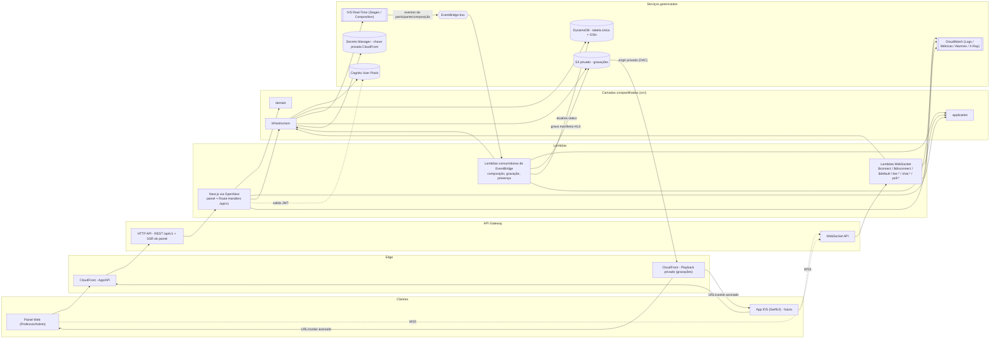

# Fase 1 — Arquitetura

Decisão de entrada (dada, não revisitada aqui): Next.js completo (painel + `/api/v1`)
empacotado em Lambda via `@opennextjs/aws`, atrás de API Gateway + CloudFront. Mais
Lambdas dedicadas para as rotas WebSocket e para os consumidores de EventBridge — essas
duas superfícies não são HTTP request/response e não cabem em Route Handlers. As três
superfícies compartilham `src/domain`, `src/application` e `src/infrastructure`.

## 1. Diagrama de arquitetura



**Por que três Lambdas e não uma só:** a Lambda do Next.js (OpenNext) responde a
eventos de API Gateway HTTP (request/response). As rotas WebSocket chegam como eventos
de API Gateway WebSocket (`$connect`, `$disconnect`, mensagens) com uma forma de evento
completamente diferente e um ciclo de vida de conexão que não existe em HTTP — não dá
para modelar como Route Handler. Os consumidores de EventBridge reagem a eventos
assíncronos do IVS (participante publicou, composição terminou) sem que exista uma
requisição HTTP em andamento. As três funções compartilham `domain`/`application`/
`infrastructure` para não duplicar regra de negócio nem acesso a dados — a diferença
entre elas é só a camada de entrada (adapter).

## 2. Fluxo de autenticação

Cognito é o único emissor de tokens (login, refresh, confirmação, recuperação de
senha). O backend nunca emite token de autenticação — ele só valida o que o Cognito
emitiu.

### Painel web (navegador)

1. O usuário faz login contra o Cognito (Hosted UI ou chamada direta ao
   `InitiateAuth`/`RespondToAuthChallenge` a partir de um Route Handler que atua como
   BFF — a decisão entre as duas fica em aberto, ver seção 8).
2. O Route Handler de sessão recebe `access_token`, `id_token` e `refresh_token` do
   Cognito e os grava como cookies `httpOnly`, `Secure`, `SameSite=Lax`. Tokens nunca
   tocam `localStorage`/JS do cliente — o painel é servido pelo próprio Next.js, então
   não há necessidade de expor o token ao browser.
3. Em cada requisição às páginas do painel ou a `/api/v1/*`, o middleware do Next.js
   lê o cookie do access token e delega a validação ao adapter de Cognito
   (`src/infrastructure/aws/cognito`): verifica assinatura via JWKS, `iss`, `aud`,
   expiração e `token_use = access`. O `sub` validado vira a identidade da requisição.
4. Perto da expiração, um Route Handler dedicado usa o refresh token (cookie) para
   chamar `InitiateAuth` com `REFRESH_TOKEN_AUTH` e rotaciona os cookies de access/id
   token. Falha no refresh → sessão encerrada, usuário redirecionado ao login.
5. Logout: apaga os cookies e, opcionalmente, chama `GlobalSignOut` no Cognito.

### App iOS (futuro)

1. O app autentica diretamente contra o Cognito (SRP via SDK/Amplify) e guarda os
   tokens no Keychain — nunca em `UserDefaults`.
2. Toda chamada a `/api/v1/*` carrega `Authorization: Bearer <access_token>`. Sem
   cookies: app nativo não compartilha cookie jar de browser, e Bearer evita a
   necessidade de proteção CSRF que cookies exigiriam.
3. O mesmo adapter de validação de JWT usado pelo painel é reutilizado aqui — a única
   diferença entre as duas superfícies é de onde o token é extraído (cookie vs.
   header), nunca como ele é validado.
4. Renovação: o app chama `InitiateAuth` com `REFRESH_TOKEN_AUTH` diretamente, sem
   depender de um Route Handler de sessão (não há cookie para rotacionar).

### Convergência

Ambas as superfícies produzem o mesmo `AuthenticatedRequestContext` (contendo `sub`,
depois enriquecido com `UserProfile.role` e `UserProfile.institutionId` buscados no
DynamoDB) antes de chegar aos casos de uso em `src/application`. Os casos de uso nunca
sabem se o request veio de cookie ou Bearer, e nunca confiam em uma role enviada no
corpo da requisição — a role vem sempre do registro de `UserProfile`, não do payload
do JWT nem do body.

## 3. Fluxo de entrada em uma live

`POST /api/v1/lives/{liveId}/join`, executado como Route Handler na Lambda Next.js.

```mermaid
sequenceDiagram
    participant C as Cliente (painel/iOS)
    participant API as Route Handler /join
    participant Auth as Cognito (validação JWT)
    participant DDB as DynamoDB
    participant IVS as IvsRealTimeService

    C->>API: POST /lives/{liveId}/join (Bearer ou cookie)
    API->>Auth: 1. valida assinatura, iss, aud, exp, token_use
    Auth-->>API: sub
    API->>DDB: GetItem UserProfile(sub)
    DDB-->>API: institutionId, role
    API->>DDB: GetItem LiveSession(PK=LIVE#{liveId}, SK=METADATA), ConsistentRead
    DDB-->>API: institutionId da live, classId, status
    API->>API: 2. institutionId do usuário == institutionId da live?
    API->>DDB: GetItem Enrollment(studentId, classId) [se ALUNO]
    DDB-->>API: 3. matrícula existe?
    API->>API: 4. status da live permite entrada? (janela + máquina de estados)
    API->>API: 5. qual a função efetiva: ADMIN / PROFESSOR (principal ou convidado) / ALUNO (comum ou promovido)?
    API->>API: 6. mapeia função -> capabilities IVS (sempre explícito, sempre inclui SUBSCRIBE)
    API->>DDB: PutItem LiveParticipant(liveId, userId) -> gera liveParticipantId (UUID opaco)
    API->>IVS: createParticipantToken(stageArn, userId=liveParticipantId, attributes={liveParticipantId, role}, capabilities, TTL curto)
    IVS-->>API: token temporário (nunca persistido, nunca logado; attributes/userId sem PII - ver nota abaixo)
    API-->>C: { live, participant, ivs, realtime }
```

As seis verificações, na ordem exata da seção 6 do README:

1. **Autenticado** — JWT válido (assinatura, `iss`, `aud`, `exp`, `token_use`); `sub`
   extraído.
2. **Pertence à instituição** — `UserProfile.institutionId` do requisitante precisa
   bater com o `institutionId` da `LiveSession` (que herda da `ClassGroup`/`Course`).
3. **Possui acesso ao curso/turma** — para `ALUNO`, existe `Enrollment` ativa na
   `ClassGroup` da live; para `PROFESSOR`, ele é o dono da turma ou está na lista de
   coapresentadores convidados.
4. **Live disponível** — estado atual permite entrada: `WAITING` ou `LIVE` sempre;
   `SCHEDULED` só dentro da janela configurada antes do horário; `ENDED`/`CANCELED`/
   `FAILED` nunca (seção 10).
5. **Função do participante** — `ADMIN`, `PROFESSOR` (principal ou coapresentador) ou
   `ALUNO` (comum ou temporariamente promovido — checado em `LiveParticipant`, não
   apenas no papel global do usuário).
6. **Capabilities do IVS** — mapeamento fixo da seção 6: professor principal e
   coapresentador → `PUBLISH`+`SUBSCRIBE`; aluno comum → `SUBSCRIBE`; aluno promovido →
   `PUBLISH`+`SUBSCRIBE`.

Depois das seis verificações, o token do IVS é criado com TTL curto, nunca é
persistido por inteiro nem aparece em log (apenas o `participantId` e metadados não
sensíveis podem ser logados). A resposta segue o DTO da seção 11 (`live` /
`participant` / `ivs` / `realtime`), incluindo a URL e o token de conexão do
WebSocket para chat/interações.

**Correção de segurança (verificada na doc oficial de `CreateParticipantToken`):**
`attributes` e `userId` do token IVS são expostos a **todos os participantes do
stage**, e a documentação é explícita — não devem conter "personally identifying,
confidential, or sensitive information". A seção 6 do README pede codificar
"usuário, live, função e instituição" no token; feito ao pé da letra (sub do
Cognito, institutionId), isso vaza esses dados para qualquer aluno da turma. Correção
adotada: `attributes`/`userId` carregam **somente o UUID opaco do `LiveParticipant`**
e a `role` — nunca `sub`, e-mail, nome, matrícula ou `institutionId`. O mapeamento
opaco → usuário real fica só no DynamoDB, do lado do servidor (o mesmo item
`LiveParticipant` que já guarda `capabilities`). "Identificar o usuário" (exigido
pela seção 6) passa a significar "o servidor consegue resolver quem é, via esse
UUID" — não "o token expõe quem é". Implementado em
`src/infrastructure/aws/ivs/participant-token-attributes.ts`, com teste que falha se
um campo sensível (por nome de chave ou por valor com cara de e-mail/JWT) entrar no
payload.

Limites confirmados na doc oficial de `CreateParticipantToken` (RealTimeAPIReference):
`capabilities` aceita 0–2 itens, valores válidos `PUBLISH`/`SUBSCRIBE`; `duration` de
1 a 20160 minutos, default 720 (12h); `attributes` até 1 KB total. **Detalhe que não
estava no desenho anterior:** se `capabilities` for omitido, o default da API é
`PUBLISH`+`SUBSCRIBE` — ou seja, esquecer de passar `capabilities` explicitamente dá
permissão de publicar a um aluno comum. Por isso a regra de negócio desta plataforma
é mais estrita que a API: `capabilities` é sempre explícito, nunca omitido, e sempre
inclui `SUBSCRIBE` (todo participante pode ao menos assistir).

## 4. Fluxo de múltiplos apresentadores

Promover e remover apresentadores nunca altera permissão permanente do usuário — o
efeito vive inteiramente dentro do escopo da live corrente (`LIVE#{liveId}`), nunca em
`UserProfile`.

```mermaid
sequenceDiagram
    participant P as Professor (dono da live)
    participant API as Route Handler /presenters/{userId}/promote
    participant DDB as DynamoDB
    participant IVS as IvsRealTimeService
    participant WS as API Gateway WebSocket
    participant U as Aluno promovido

    P->>API: POST /lives/{liveId}/presenters/{userId}/promote
    API->>API: professor é dono/coapresentador desta live?
    API->>DDB: GetItem LiveParticipant(liveId, userId)
    DDB-->>API: participante já está na live? (obrigatório) + liveParticipantId (UUID opaco)
    API->>DDB: UpdateItem capabilities=[PUBLISH,SUBSCRIBE], promotedAt=now
    API->>DDB: escreve entrada esparsa no GSI3 (índice de apresentadores ativos)
    API->>IVS: createParticipantToken(stageArn, userId=liveParticipantId, attributes={liveParticipantId, role}, capabilities=[PUBLISH,SUBSCRIBE] explícito)
    IVS-->>API: novo token (capabilities são fixadas na criação do token; não dá para "upgradar" o token antigo)
    API->>WS: envia participant.promoted {token} para a connectionId ativa do aluno
    WS-->>U: aluno chama publish() no SDK do IVS sem reconectar ao Stage
```

Pontos de design:

- **Capabilities são imutáveis no token IVS** — promover/rebaixar sempre emite um
  token novo com o `participantId` existente (mesma identidade no Stage), em vez de
  tentar alterar um token já emitido. Isso evita reconexão ao Stage.
- **Nada permanente é gravado** — a mudança de capability vive em
  `LiveParticipant.capabilities`, escopado a `LIVE#{liveId}`; ao encerrar a live esse
  item não é reaproveitado em uma live futura.
- **Índice de apresentadores ativos (GSI3)** é esparso: só existe entrada enquanto o
  participante tem `PUBLISH`; isso permite listar quem está publicando sem varrer
  todos os participantes (necessário para exibir a grade de vídeo e para limites de
  apresentadores simultâneos do IVS).
- **Idempotência** (regra da seção 10 e 17): promover quem já está promovido apenas
  reemite o token, sem erro; rebaixar quem já não publica é um no-op que também
  reemite (ou simplesmente confirma) o estado `SUBSCRIBE`.
- **Sem promoção de quem não está na live** — só é possível promover um `userId` que
  já tenha um `LiveParticipant` (ou seja, já executou o fluxo de `join`).
- **Identidade opaca também no rebaixamento** — o token reemitido ao rebaixar usa o
  mesmo `liveParticipantId` e passa `capabilities=['SUBSCRIBE']` **explicitamente**
  (nunca omite o campo — default da API seria `PUBLISH`+`SUBSCRIBE`, ver seção 3).

**Verificado (não é mais risco em aberto): por que não usamos o `TOKEN_EXCHANGED`
nativo do IVS.** O IVS Real-Time tem um mecanismo de troca de token
(`Stage.exchangeToken`) que evita reconexão e gera um evento `TOKEN_EXCHANGED` no
EventBridge — à primeira vista, mais simples que reemitir um token novo. Mas a
documentação oficial é explícita: _"Token exchange only works with tokens created on
your server using a key pair. It does not work with tokens created via the
CreateParticipantToken API."_ Como a seção 6 do README exige tokens emitidos pelo
backend e `CreateParticipantToken` é a operação gerenciada correspondente, os dois
mecanismos são mutuamente exclusivos — adotar `exchangeToken` exigiria abandonar
`CreateParticipantToken` e passar a assinar tokens nós mesmos com um par de chaves
próprio, uma mudança de arquitetura maior que não foi pedida. Decisão: manter
`CreateParticipantToken` + reemissão de token novo por promoção/remoção. Trade-off
aceito: o cliente pode ter um reconnect breve ao Stage ao trocar de token (diferente
do swap sem reconexão do `exchangeToken`); a UX disso fica para a Fase 8 (painel) e
para o guia de integração SwiftUI avaliarem.

## 5. Fluxo de gravação e replay

```mermaid
sequenceDiagram
    participant Prof as Professor
    participant API as Route Handler
    participant IVS as Amazon IVS
    participant EB as EventBridge (bus default da conta)
    participant EL as Lambda consumidora (ivs-event-consumer)
    participant S3 as S3 (privado)
    participant DDB as DynamoDB
    participant CF as CloudFront

    Prof->>API: POST /lives/{liveId}/start
    API->>IVS: cria/ativa Stage
    Prof->>IVS: começa a publicar
    IVS->>EB: "IVS Stage Update" / detail.event_name = "Participant Published"
    EB->>EL: regra casa source=aws.ivs + detail-type + event_name
    EL->>IVS: startComposition(stageArn, encoderConfigurationArn, storageConfigurationArn)
    EL->>DDB: Recording PENDING -> STARTING (ConditionExpression por event_time)
    IVS->>S3: grava composição em HLS (bucket privado, Object Ownership "Bucket owner enforced")
    Prof->>API: POST /lives/{liveId}/finish
    API->>IVS: encerra publicação/Stage
    IVS->>EB: "IVS Composition State Change" / event_name = "Session End"
    EB->>EL: dispara consumidor
    EL->>DDB: Recording -> PROCESSING (só se event_time > último registrado)
    IVS->>EB: "IVS Participant Recording State Change" / event_name = "Recording End"
    EB->>EL: dispara consumidor
    EL->>DDB: Recording -> READY (manifestPath, duração)
    Prof->>API: POST /recordings/{id}/publish
    API->>DDB: Recording.visibility = PUBLISHED
    Note over CF,S3: CloudFront com Origin Access Control; bucket sem acesso público
    API->>CF: GET /recordings/{id}/playback -> gera URL/cookie assinado (TTL curto)
    CF-->>Prof: playback via URL assinada
```

**Eventos reais (verificados na doc oficial `aws.ivs`, não mais placeholder):** só três
`detail-type` interessam, e o nome do evento **não** é o detail-type — fica em
`detail.event_name`. Padrão de regra EventBridge:

```json
{
  "source": ["aws.ivs"],
  "detail-type": ["IVS Stage Update"],
  "detail": { "event_name": ["Participant Published"] }
}
```

| detail-type                              | event_name relevantes para o fluxo de gravação                                                                                               |
| ---------------------------------------- | -------------------------------------------------------------------------------------------------------------------------------------------- |
| `IVS Stage Update`                       | `Participant Published`, `Participant Unpublished`                                                                                           |
| `IVS Composition State Change`           | `Session Start`, `Session End`, `Session Failure`, `Destination Start`, `Destination End`, `Destination Failure`, `Destination Reconnecting` |
| `IVS Participant Recording State Change` | `Recording Start`, `Recording End`, `Recording Start Failure`, `Recording End Failure`                                                       |

Esses eventos chegam no **event bus default da conta** (IVS não publica em bus
customizado) — o bus próprio da plataforma (`EVENTBRIDGE_BUS_NAME`) é usado só para
eventos internos que a própria aplicação emitir (ex. notificações entre módulos), não
para receber eventos do IVS.

**Decisão de design — consumidores tolerantes a entrega fora de ordem (não só
idempotentes):** a AWS documenta que a entrega desses eventos é _best-effort_: podem
faltar, chegar com horas de atraso, ou fora de ordem (o exemplo da própria doc é
`Participant Unpublished` chegando antes de `Participant Published`). Consequência
direta para a máquina de estados de `Recording`: nenhuma transição pode ser aplicada
só porque "o evento chegou". Cada `Recording`/`LiveSession` grava o `event_time` do
último evento aplicado, e toda escrita usa `ConditionExpression` comparando o
`event_time` do payload recebido com o já registrado — só aplica se for mais recente.
Um evento antigo que chega atrasado é descartado (log, sem erro), não processado.
Isso é adicional à idempotência por `event_name`/id de evento já exigida pela seção 20
do README — idempotência sozinha não resolve fora-de-ordem.

**Padrão de acesso que faltava (item #13, seção 6):** antes de aplicar qualquer
atualização condicional por `event_time`, o consumidor precisa descobrir a QUE live
(e, se aplicável, qual `Recording`) o evento se refere — os eventos só trazem ARNs,
nunca `liveId`. Verificado nos exemplos oficiais que o campo muda de lugar por
`detail-type`:

- `IVS Stage Update` e `IVS Participant Recording State Change`: o ARN do stage vem
  em `resources[0]` (envelope top-level).
- `IVS Composition State Change`: `resources[0]` traz o ARN da **composição**, não do
  stage; o ARN do stage vem em `detail.stage_arn`.

O consumidor extrai o stage ARN dessa forma (dependendo do `detail-type`) e resolve
via padrão #13 (Query em GSI2, `GSI2PK = STAGE#{stageArn}` → item `LiveSession`, que
carrega um atributo `activeRecordingId` denormalizado quando há gravação em
andamento). Se precisar do item `Recording` em si, uma segunda Query em GSI2
(`GSI2PK = RECORDING#{recordingId}`) resolve, reaproveitando o mesmo índice já usado
pelo padrão #9.

**Pré-requisitos de IVS que faltavam no desenho anterior:** composite recording exige
dois recursos IVS criados antes de qualquer composição, reutilizáveis entre Stages —
por isso vão na stack de IVS (Fase 3), não são criados por live:

- **EncoderConfiguration** — define resolução/bitrate/fps do vídeo composto.
- **StorageConfiguration** — aponta para o bucket S3 e concede ao IVS permissão de
  escrita nele.

Regras que o fluxo precisa respeitar (seção 7 e 14):

- O bucket S3 é privado; nenhuma URL direta do S3 é retornada em qualquer endpoint.
- **Object Ownership do bucket precisa ser "Bucket owner enforced" (ou "Bucket owner
  preferred")** — exigência documentada para composite recording; sem isso o IVS não
  consegue gravar. Configurado explicitamente na stack do S3, não é o default do CDK.
- CloudFront acessa o S3 via Origin Access Control; o cliente só recebe URL/cookie
  assinado do CloudFront, nunca do S3.
- `GET /recordings/{id}/playback` só gera URL assinada se `visibility = PUBLISHED` **e**
  o solicitante tiver matrícula na turma correspondente à gravação (mesma checagem de
  instituição/matrícula do fluxo de `join`).
- Ocultar uma gravação (`HIDDEN`) não apaga o objeto do S3 — só para de emitir URLs
  assinadas para ela.
- Todo consumidor de evento do EventBridge é idempotente **e** condicional por
  `event_time` (regra da seção 20 + decisão acima): o mesmo evento pode chegar
  duplicado ou fora de ordem e não pode gerar duas transições de estado, duas
  gravações, nem regredir um estado mais avançado para um mais antigo.

## 6. Padrões de acesso do DynamoDB

Revisão desta seção após um bloqueador real: **GetItem não existe em GSI** (índice
secundário só suporta Query/Scan) **e GSI nunca é `ConsistentRead`** — é sempre
eventualmente consistente. O desenho anterior tinha esse bug em dois padrões (#6 e
#11), não só um; ambos corrigidos abaixo. Também adicionado o padrão #13, que faltava
para a Fase 7 fechar, e o padrão #5 foi redesenhado (a versão anterior não paginava
por cursor e degradava com o tempo).

Treze padrões, cada um com PK, SK, índice e se a leitura é forte ou eventual:

| #   | Padrão de acesso                                                 | Operação                                                                         | PK                                                                     | SK                                                                               | Índice                                        | Consistência                                                                            |
| --- | ---------------------------------------------------------------- | -------------------------------------------------------------------------------- | ---------------------------------------------------------------------- | -------------------------------------------------------------------------------- | --------------------------------------------- | --------------------------------------------------------------------------------------- |
| 1   | Buscar usuário pelo Cognito `sub`                                | GetItem                                                                          | `USER#{sub}`                                                           | `PROFILE`                                                                        | tabela base                                   | **Forte** (`ConsistentRead`) — decide autorização                                       |
| 2   | Listar cursos de um aluno                                        | Query                                                                            | `USER#{studentId}`                                                     | `begins_with(SK, 'ENROLLMENT#')`                                                 | tabela base                                   | Eventual (listagem)                                                                     |
| 3   | Listar turmas de um professor                                    | Query                                                                            | `TEACHER#{teacherId}`                                                  | `begins_with(GSI1SK, 'CLASS#')`                                                  | GSI1                                          | Eventual (obrigatório em GSI)                                                           |
| 4   | Listar lives de uma turma                                        | Query                                                                            | `CLASS#{classId}`                                                      | `{scheduledStartAt}#{liveId}` (`SK > now`, `Limit`)                              | **GSI1** (movido de tabela base — é listagem) | Eventual (obrigatório em GSI; listagem tolera)                                          |
| 5   | Listar próximas lives de um aluno                                | Query (projeção materializada na escrita — ver nota abaixo)                      | `USER#{studentId}`                                                     | `UPCOMING#{scheduledStartAt}#{liveId}` (`SK > now`, `Limit`, `LastEvaluatedKey`) | tabela base                                   | Eventual (listagem)                                                                     |
| 6   | Buscar uma live pelo ID                                          | **GetItem** (corrigido — era GetItem em GSI, inválido)                           | `LIVE#{liveId}`                                                        | `METADATA`                                                                       | **tabela base** (movido do GSI2)              | **Forte** — `start`/`finish` dependem disso para idempotência                           |
| 7   | Listar participantes de uma live                                 | Query                                                                            | `LIVE#{liveId}`                                                        | `begins_with(SK, 'PARTICIPANT#')`                                                | tabela base                                   | Eventual (listagem)                                                                     |
| 8   | Verificar matrícula de um aluno                                  | GetItem                                                                          | `USER#{studentId}`                                                     | `ENROLLMENT#{classId}`                                                           | tabela base                                   | **Forte** — gate de autorização (fluxo de `join`)                                       |
| 9   | Listar gravações de uma disciplina                               | Query                                                                            | `COURSE#{courseId}`                                                    | `begins_with(SK, 'RECORDING#')`                                                  | tabela base                                   | Eventual (listagem)                                                                     |
| 10  | Buscar interações de uma live                                    | Query — chat faz fan-out em N shards (ver nota); pergunta/enquete, query única   | Chat: `LIVE#{liveId}#{shard}`. Pergunta/enquete: `LIVE#{liveId}`       | `begins_with(SK, 'CHAT#')` / `'QUESTION#'` / `'POLL#'`                           | tabela base                                   | Eventual (histórico)                                                                    |
| 11  | Buscar conexões WebSocket ativas                                 | Query (broadcast) **e** Query (lookup — corrigido, era GetItem em GSI, inválido) | Broadcast: `LIVE#{liveId}`. Lookup: `CONNECTION#{connectionId}` (GSI2) | Broadcast: `begins_with(SK, 'CONNECTION#')`. Lookup: `CONNECTION#{connectionId}` | tabela base (broadcast) / **GSI2** (lookup)   | Eventual (ambas)                                                                        |
| 12  | Listar presença dos alunos                                       | Query                                                                            | `LIVE#{liveId}`                                                        | `begins_with(SK, 'ATTENDANCE#')`                                                 | tabela base                                   | Eventual (listagem)                                                                     |
| 13  | **Novo** — resolver `stage_arn` (evento EventBridge) para a live | Query                                                                            | `STAGE#{stageArn}`                                                     | `STAGE#{stageArn}`                                                               | **GSI2**                                      | Eventual (obrigatório em GSI; consumidor já é idempotente/condicional por `event_time`) |

### Por que #6 e #11 estavam quebrados

"GetItem em GSI2" nunca foi executável — GSI só aceita Query/Scan. Consequência
prática para #6: `POST /lives/{liveId}/start` e `/finish` precisam de
`ConditionExpression` para serem idempotentes (seção 10); se a leitura vier de um
índice eventualmente consistente, duas chamadas concorrentes podem ler o mesmo estado
velho e as duas passarem na condição. Correção: o item de metadados da live vira
`PK=LIVE#{liveId}`, `SK=METADATA` **na tabela base** — mesma partição de
participantes (#7), presença (#12) e conexões (#11) — permitindo `GetItem` com
`ConsistentRead=true`. Em troca, "lives de uma turma" (#4), que **é** uma listagem e
tolera defasagem, migrou para GSI1 com a chave ordenada por tempo. O mesmo bug existia
em #11 (lookup de conexão por `connectionId` também estava descrito como GetItem em
GSI2); corrigido para Query.

### #13 libera o GSI2 para a live

Como #6 não usa mais GSI2, sobra espaço lógico nesse índice: `GSI2PK=STAGE#{stageArn}`
agora resolve o item `LiveSession`. GSI2 continua compartilhado por três entidades
(`LiveSession` por `stageArn`, `Recording` por `recordingId`, `WebSocketConnection`
por `connectionId`) — igual à prática já adotada, prefixo de PK distingue o tipo.
Nenhum GSI novo foi necessário.

### #5 — próximas lives de um aluno: fan-out na escrita

A versão anterior fazia fan-out na leitura ((2) para achar `classId`s, depois (4) por
turma, filtrando em memória) — trazia **todas** as lives já criadas de cada turma, o
que degrada ao longo do semestre, e não dá pra paginar por cursor sobre o merge de N
queries independentes sem reimplementar um mini-merge-sort com cursor composto.

Trade-off escolhido: **fan-out na escrita**. Ao agendar/criar uma live, o caso de uso
grava uma projeção por aluno matriculado na turma: `PK=USER#{studentId}`,
`SK=UPCOMING#{scheduledStartAt}#{liveId}`, item pequeno (só os campos exibidos numa
lista — título, horário, `liveId`). "Próximas lives" vira uma Query de partição única
com `SK > now`, `Limit` e `LastEvaluatedKey` — paginação por cursor real, sem
merge de múltiplas fontes.

**O custo real não é só "mais escrita ao criar uma live"** — como `scheduledStartAt`
faz parte da SK, a projeção nunca é atualizada in-place: qualquer mudança é
delete+put. Isso cria **quatro caminhos de manutenção**, não um:

| Caminho                                        | Gatilho                              | Ação                                                                                                  | Fase                               |
| ---------------------------------------------- | ------------------------------------ | ----------------------------------------------------------------------------------------------------- | ---------------------------------- |
| a) Live reagendada                             | `PATCH /lives/{liveId}` muda horário | Apagar a projeção antiga (SK antiga) e escrever a nova (SK nova), para todos os matriculados na turma | Fase 5 (lives)                     |
| b) Live cancelada                              | Cancelamento da live                 | Apagar as projeções de todos os matriculados                                                          | Fase 5 (lives)                     |
| c) Matrícula criada depois da live já agendada | `EnrollStudent`                      | Backfill: criar projeções de todas as lives futuras da turma para esse aluno                          | **Fase 4** (é a própria matrícula) |
| d) Matrícula cancelada                         | `UnenrollStudent`                    | Apagar as projeções das lives futuras da turma para esse aluno                                        | **Fase 4** (é a própria matrícula) |

(c) e (d) são implementados nesta fase junto com `EnrollStudent`/`UnenrollStudent`
(`src/application/use-cases/enroll-student.ts`,
`src/application/use-cases/unenroll-student.ts`) — sem eles, um aluno matriculado
depois da live já agendada não veria a aula ("aula fantasma" ao contrário: ausente),
ou um aluno desmatriculado continuaria vendo aulas de uma turma que não frequenta
mais. (a) e (b) ficam para a Fase 5, quando `LiveSession` existir.

**Escala e idempotência (c/d):** uma turma pode ter mais alunos do que cabe numa
operação atômica única. `TransactWriteItems` tem limite de 100 itens — mas como cada
projeção é independente (chave própria, sobrescrita sem efeito colateral) e não há
necessidade de atomicidade _entre_ itens, a operação real usada é
`BatchWriteItem` (limite **25** itens e **16 MB** por chamada, não 100 — número
diferente porque é uma API diferente; `TransactWriteItems` seria mais caro em WCU pelo
protocolo de duas fases e não compra nada aqui, já que não precisamos de
tudo-ou-nada). Implementado em
`src/infrastructure/repositories/dynamodb-upcoming-live-repository.ts`: lotes de até
25, cada lote reenviando `UnprocessedItems` até esvaziar (o retorno normal de
`BatchWriteItem` para itens que não couberam no throughput do momento) com **backoff
exponencial** entre tentativas (50ms, 100ms, 200ms... até 5s) — um loop apertado só
pioraria o throttling que causou o `UnprocessedItems`. O reenvio em si _é_ o retry
idempotente pedido, não uma camada extra.

**Duas restrições reais que essa escolha impõe** (não são hipotéticas — são a API):

- `BatchWriteItem` **não aceita `ConditionExpression`**. Se algum dia uma escrita de
  projeção precisar ser condicional (ex.: "não sobrescrever se já existe uma versão
  mais nova"), esse caminho específico tem que cair para `PutItem` individual — não dá
  para expressar a condição dentro de um `BatchWriteItem`. Hoje nenhum dos caminhos
  (c)/(d) precisa disso (a chave já é determinística e a sobrescrita é sempre segura),
  mas fica registrado para quando (a) for implementado, abaixo.
- No caminho **(a)** (live reagendada, Fase 5): como `scheduledStartAt` está na SK, um
  reagendamento é sempre `DELETE` do item antigo + `PUT` do novo — nunca um `UPDATE`
  in-place. Os dois **não são atômicos por aluno** dentro do `BatchWriteItem` (cada
  request do batch — put ou delete — é processado independentemente pela API). Se o
  delete de um aluno for aplicado e o put falhar (ou vice-versa) antes da
  reconciliação rodar, esse aluno especificamente fica sem a aula na lista de
  "próximas lives" até a reconciliação corrigir — um risco concreto, não teórico, que
  a Fase 5 precisa tratar (ex.: ordenar como put-novo-depois-delete-antigo reduz a
  janela de "aluno sem nada", ao custo de aceitar brevemente duas entradas para a
  mesma aula).

**Falha parcial:** se o processo cair no meio do backfill de uma turma grande (alguns
lotes gravados, outros não), o aluno fica com projeções parciais — não é um estado
inconsistente _permanente_ porque a operação é idempotente e pode ser reexecutada
inteira sem duplicar nada (mesma chave = mesmo item). Não implementada agora: uma
rotina de reconciliação (ex. Lambda agendada) que compare `Enrollment`s ativos contra
projeções `UPCOMING#` existentes e complete o que faltar — registrado como pendência
de operação, não como bloqueador da Fase 4.

Cancelamento/reagendamento (a/b, Fase 5) atualiza ou remove a projeção explicitamente;
um TTL (`scheduledStartAt` + margem curta) é rede de segurança para projeções órfãs
(ex. um caminho de manutenção que falhou e não foi reconciliado), não o mecanismo
principal de correção.

### GSIs resultantes (ainda só três)

- **GSI1** — `GSI1PK`/`GSI1SK`: "por dono" (turmas de um professor) **e**, agora,
  "lives de uma turma ordenadas por horário" (`GSI1PK=CLASS#{classId}`,
  `GSI1SK={scheduledStartAt}#{liveId}`).
- **GSI2** — `GSI2PK`/`GSI2SK`: busca por id plano — `LiveSession` por `stageArn`
  (novo), `Recording` por `recordingId`, `WebSocketConnection` por `connectionId`.
- **GSI3** — esparso, só contém entrada enquanto `LiveParticipant.capabilities`
  inclui `PUBLISH` (apresentadores ativos, seção 4).

**Paginação:** cursor opaco em base64 sobre o `LastEvaluatedKey` do DynamoDB (seção
12). Agora implementável de fato nos padrões #4 e #5 (SK ordenada por tempo, Query de
partição única) — não era no desenho anterior de #5.

**TTL:** `WebSocketConnection` tem TTL (rede de segurança contra `$disconnect`
perdido); a projeção `UPCOMING#` do padrão #5 também tem TTL (rede de segurança, não
mecanismo principal); reações **não são gravadas no DynamoDB** — trafegam só pelo
WebSocket.

### Hot partition — chat isolado do resto

`LIVE#{liveId}` ainda concentra participantes (#7), presença (#12) e conexões (#11) —
"tudo bem" porque o volume é limitado pelo tamanho da turma. **Chat não é** (reações
já não tocam o DynamoDB, então não entram nesta conta apesar de mencionadas junto no
pedido de revisão). Chat usa `PK=LIVE#{liveId}#{shard}`, `shard = hash(userId) %
chatShardCount`. Número de shards configurável por ambiente
(`infrastructure/lib/config.ts`, `EnvironmentConfig.chatShardCount`):
`development=2`, `staging=4`, `production=16`. Dezesseis em produção porque o limite
por partição é 1000 WCU/s — mesmo no cenário mais pesado plausível para uma
universidade (uma aula magna com milhares de espectadores enviando chat), 16 shards
dão um teto agregado de 16.000 WCU/s só para chat, folga generosa sobre qualquer
volume realista desse domínio; é potência de 2 para distribuição uniforme do hash.
Consequência no lado da leitura (registrada, não resolvida aqui — é Fase 6): ler
"chat de uma live" agora exige Query nos `chatShardCount` shards e merge por
timestamp; um cursor de paginação de chat vira um cursor composto (um
`LastEvaluatedKey` por shard), mais complexo que uma Query única. Pergunta/enquete
continuam sem shard — volume ordens de magnitude menor que chat.

## 7. Single-table vs. múltiplas tabelas

**Decisão: tabela única (single-table design).**

Justificativa a partir dos padrões do item 6:

- Nenhum dos treze padrões precisa de um GSI por entidade — três índices cobrem as 16
  entidades porque a maioria das consultas é "todos os itens com este PK e um prefixo
  de SK", que single-table resolve nativamente com uma única Query.
- Vários padrões (5, 10, 11) combinam ou dependem de itens de tipos diferentes sob o
  mesmo PK lógico (`LIVE#{liveId}` reúne `LiveParticipant`, `ChatMessage`,
  `Question`, `Poll`, `Attendance`, `WebSocketConnection`) — exatamente o caso de uso
  que single-table resolve bem (buscar entidades relacionadas numa única partição) e
  que múltiplas tabelas obrigaria a várias chamadas cross-table.
- Operações que precisam ser atômicas (ex. iniciar uma live e gravar o evento de
  auditoria correspondente) cabem em um `TransactWriteItems` de uma tabela só; com
  múltiplas tabelas isso também é possível, mas sem ganho nenhum, só mais superfície
  de IAM e mais stacks de CDK para manter.
- O contra-argumento clássico para múltiplas tabelas é isolar entidades com perfis de
  acesso/escala muito diferentes (para políticas de backup, criptografia ou billing
  independentes). Nenhuma das 16 entidades aqui tem esse perfil divergente — todas
  pertencem ao mesmo domínio limitado (ciclo de vida de curso/turma/live) e à mesma
  escala (uma universidade, não uma plataforma multi-tenant de milhões de
  organizações).
- Menos tabelas = menos políticas IAM mínimas por Lambda para manter (relevante para a
  Fase 3, que só pode ser desenhada depois desta decisão, conforme pedido).

Isso fecha o pré-requisito da Fase 3: **uma tabela**, **três GSIs** (GSI1, GSI2, GSI3
descritos acima), e a política IAM mínima de cada Lambda pode ser desenhada em cima
dessas chaves (ex.: a Lambda de `$connect`/`$disconnect` só precisa de
`PutItem`/`DeleteItem`/`Query` restrito aos itens `CONNECTION#*` e ao GSI2, não à
tabela inteira).

## 8. Riscos técnicos e decisões em aberto

**Fechados nesta revisão** (mantidos aqui só como registro, não precisam mais de
verificação):

- ~~Vazamento de existência via 403 cross-institution~~ — `assertSameInstitution`
  lançava `ForbiddenError` com código `CROSS_INSTITUTION_ACCESS_DENIED`, que confirma
  ao atacante que o recurso existe em outra instituição (a própria enumeração que a
  seção 14 do README proíbe). Corrigido para `NotFoundError` genérico (`404`,
  `RESOURCE_NOT_FOUND`, mensagem neutra) — byte-a-byte idêntico ao caso "recurso não
  existe". `assertClassOwner` continua `403`/`CLASS_NOT_OWNED`: dentro da mesma
  instituição, quem tenta mexer numa turma alheia já sabe legitimamente que ela
  existe, então não há vazamento ali. Este é o padrão para todo caso de uso
  institucional a partir daqui, inclusive Fase 5. Teste em
  `tests/unit/application/authorization/anti-enumeration.test.ts`.
- ~~Nomes reais dos eventos do IVS Real-Time no EventBridge~~ — verificado na doc
  oficial `aws.ivs`; ver tabela na seção 5.
- ~~Compatibilidade do `@opennextjs/aws` com esta versão do Next.js~~ — verificado:
  `@opennextjs/aws@4.1.0` declara peer `next >=15.5.21 <16 || >=16.2.11`; o projeto
  está em `next@16.2.12`, dentro da faixa suportada.
- ~~Mecanismo de promoção/rebaixamento de apresentador~~ — verificado que
  `TOKEN_EXCHANGED`/`exchangeToken` não é compatível com `CreateParticipantToken`; ver
  nota na seção 4.
- ~~Padrão #6 (buscar live pelo ID) executável~~ — GetItem em GSI não existe;
  corrigido para GetItem consistente na tabela base (mesmo bug corrigido em #11). Ver
  seção 6.
- ~~Padrão #13 faltando (stage_arn → live)~~ — adicionado, usa o GSI2 liberado pela
  correção do #6. Ver seção 5/6.
- ~~Fan-out do padrão 5 sem paginação~~ — redesenhado com projeção materializada na
  escrita (`USER#{studentId}` / `UPCOMING#...`); paginação por cursor agora é uma
  Query de partição única, não um merge de N queries. Ver seção 6.
- ~~Hot partition de chat~~ — chat isolado em `LIVE#{liveId}#{shard}` com
  `chatShardCount` configurável por ambiente (2/4/16). **Parcialmente aberto:** o
  fan-out de leitura (Query em N shards + merge por timestamp, cursor composto) ainda
  não está implementado — fica para a Fase 6, registrado no fim da seção 6.
- ~~Segurança dos atributos do token IVS~~ — `attributes`/`userId` agora carregam só
  identificador opaco (`liveParticipantId`) + `role`; nunca `sub`, e-mail,
  institutionId. Guard + testes em
  `src/infrastructure/aws/ivs/participant-token-attributes.ts`. Ver seção 3.
- ~~Resource-level permissions do IVS Real-Time (IAM)~~ — minhas tentativas de acessar
  a Service Authorization Reference foram bloqueadas (página renderizada por JS); a
  tabela completa foi obtida por revisão manual. Praticamente toda ação relevante
  exige um resource type específico: `CreateStage`/`GetStage`/`UpdateStage`/
  `DeleteStage`/`CreateParticipantToken`/`DisconnectParticipant` → `stage`;
  `StopComposition`/`GetComposition` → `composition` (não `stage` — assimetria real);
  `StartComposition` → `stage` **e** `encoder-configuration` simultaneamente (dois
  recursos obrigatórios, não um "ou"). `Resource: ["*"]` substituído por ARNs
  escopadas por tipo, com `Condition` por tag `Environment` (`aws:RequestTag` na
  criação, `aws:ResourceTag` nas operações subsequentes) isolando de verdade
  development/staging/production — uma Lambda de dev não consegue operar sobre uma
  stage de produção mesmo com o ARN em mãos. Implementado em
  `infrastructure/stacks/api-stack.ts` e `event-bus-stack.ts`; `ivs:ListCompositions`
  removido (não estava confirmado e nenhum fluxo documentado usa).

**Em aberto:**

- **Auto-shutdown de composição após 60s sem publisher** — uma composição do IVS
  Real-Time faz shutdown automático após 60 segundos sem nenhum publisher ativo no
  Stage, vai para `STOPPED` e é deletada automaticamente poucos minutos depois. Caso
  real: se a conexão do professor cair por mais de 60s, a composição morre e a
  gravação fragmenta. **Não resolvido agora** — antes de implementar a Fase 7 é preciso
  decidir o comportamento esperado: reiniciar composição automaticamente ao detectar
  novo `Participant Published`? Tratar como duas gravações distintas? Tentar unir os
  dois manifestos HLS em uma gravação lógica só? Fica registrado, não implementado.
- **Limites de serviço do IVS Real-Time Composition** (quantos apresentadores
  simultâneos a composição server-side suporta, layout de grade) precisam ser
  confirmados na documentação atual antes de fechar o desenho de `IvsRealTimeService`
  na Fase 5/7.
- **Cold start da Lambda do painel** — uma função Next.js via OpenNext tende a ser
  maior e mais lenta de inicializar que as Lambdas de WebSocket/EventBridge; decisão
  sobre concorrência provisionada fica pendente para quando houver número de usuários
  simultâneos esperado.
- **Fan-out de leitura do chat sharded** — ler "chat de uma live" exige Query em
  `chatShardCount` partições + merge por timestamp; cursor de paginação vira composto
  (um `LastEvaluatedKey` por shard). Não implementado, fica para a Fase 6.
- **Moderação de mensagem individual em chat shardado** — apagar/moderar UMA mensagem
  exige saber a `PK` exata (`LIVE#{liveId}#{shard}`), e o shard não é derivável da
  mensagem sozinha sem repetir o hash. Decisão a implementar na Fase 6, registrada
  agora: o **ID da mensagem carrega o shard embutido** (ex. `{shard}#{ulid}`, não um
  UUID opaco) — assim `chat.delete` extrai o shard do próprio `messageId` sem precisar
  do `userId` do autor (que a UI de moderação do professor pode nem ter à mão) nem de
  uma segunda consulta. Alternativa descartada: exigir que a API de moderação sempre
  receba o `userId` do autor para recalcular o hash — funciona, mas acopla moderação a
  um dado que a mensagem já deveria carregar.
- **Hosted UI do Cognito vs. formulário de login customizado no painel** — impacta
  diretamente o passo 1 do fluxo de autenticação (seção 2) e ainda não foi decidido.
- **Estratégia de rate limiting por usuário no WebSocket** (seção 8 do README) — se
  via throttling nativo do API Gateway ou via contagem em DynamoDB com TTL, ainda em
  aberto.
- **Definição de qual identidade assina URLs do CloudFront** (par de chaves
  CloudFront vs. CloudFront Functions/Lambda@Edge para signed cookies) — resolvido
  parcialmente na Fase 3 (KeyGroup + PublicKey do CloudFront); a rotação da chave
  privada e o processo operacional de troca continuam em aberto.

Fase 3 permanece aprovada; nenhuma stack foi alterada estruturalmente por esta
revisão (a tabela continua 1 tabela + 3 GSIs — só o _uso lógico_ de #6/#11/#13
mudou, e chat ganhou uma variável de ambiente `CHAT_SHARD_COUNT`). Repositórios e
casos de uso da Fase 4 (usuários, cursos, turmas, matrículas, autorização) foram
implementados nessa fase, com os testes críticos de anti-enumeração e "professor
turma alheia" priorizados.

## 9. Fase 5 — cotas de taxa do IVS, correção sobre Token Exchange, ordem de operações e `participantId`

Quatro fatos verificados na documentação oficial antes de implementar (pedido
explícito: "leia antes de escrever código"), que mudam o desenho desta fase.

### 9.1 Cotas de taxa da API do IVS Real-Time são fixas, não ajustáveis

Confirmado em `RealTimeUserGuide/service-quotas.html`: _"API call rate quotas are not
adjustable."_

| Ação                     | TPS |
| ------------------------ | --- |
| `CreateStage`            | 5   |
| `DeleteStage`            | 5   |
| `DisconnectParticipant`  | 5   |
| `GetStage`               | 5   |
| `StartComposition`       | 5   |
| `StopComposition`        | 5   |
| `GetComposition`         | 5   |
| `CreateParticipantToken` | 50  |

Cenário real: 40 professores iniciando aula na mesma hora cheia esgotariam
`CreateStage` (5 TPS) em segundos se ele fosse chamado no `/start`. Desenho adotado:

- **`CreateStage` sai do `/start`.** Um novo caso de uso,
  `ProvisionLiveStageUseCase` (`src/application/use-cases/provision-live-stage.ts`),
  cria o Stage quando a live entra em `WAITING` — espalhado no tempo, fora do pico da
  hora cheia. `/start` (`StartLiveUseCase`) fica sem nenhuma chamada à API do IVS: só
  ativa (`WAITING` -> `LIVE`) um Stage que já existe. Disparo hoje: chamada explícita
  (ex. primeiro acesso à sala de espera). **Não implementado nesta fase:** uma rotina
  agendada (EventBridge Scheduler + Lambda) que provisione Stages preemptivamente N
  minutos antes do horário — ficaria mais uniforme que depender do primeiro acesso,
  registrado como melhoria futura.
- **Retry com backoff exponencial e jitter: usa o mecanismo do próprio SDK, não
  reimplementado.** Verificado no código-fonte de `@smithy/core` (pacote usado por
  todo AWS SDK v3): `defaultDelayDecider = (delayBase, attempts) =>
Math.min(MAXIMUM_RETRY_DELAY, Math.random() * 2 ** attempts * delayBase)` — é o
  algoritmo "full jitter" recomendado pela própria AWS, já embutido por padrão.
  `IvsRealTimeService` (`src/infrastructure/aws/ivs/ivs-real-time-service.ts`)
  configura `maxAttempts: 8` (padrão do SDK é 3) — as cotas de 5 TPS por ação
  justificam mais tentativas que o normal. Reimplementar isso por conta própria valeria
  menos que configurar o que o SDK já faz corretamente.
- **`ThrottlingException` (confirmado em `RealTimeAPIReference/CommonErrors.html`,
  HTTP 400) nunca é erro fatal.** `IvsRealTimeService` traduz qualquer
  `ThrottlingException` que sobreviva às tentativas do SDK para
  `ServiceUnavailableError` (`src/domain/errors/ServiceUnavailableError.ts`), mapeado
  para HTTP 503 (`src/shared/http/httpStatusForError.ts`) — nunca 500.
  `ProvisionLiveStageUseCase` reverte `WAITING` -> `SCHEDULED` nesse caso (nunca
  `FAILED`) e relança; um retry do cliente tenta de novo do zero. Testado em
  `tests/unit/application/use-cases/provision-live-stage.test.ts`.
- **Métrica e alarme dedicados para throttling.** A seção 15 do README já pede
  "falhas ao criar Stage" e "falhas ao gerar token" — throttling precisa ser contado
  separado de falha real (um é esperado sob carga, o outro não). **Não implementado
  nesta fase:** emissão de métrica (EMF ou `PutMetricData`) e alarme CloudWatch — é
  Fase 9 (Observabilidade). Registrado aqui para não ser esquecido: o
  `ServiceUnavailableError` já existe como sinal de domínio distinto de erro genérico,
  então a Fase 9 só precisa emitir a métrica onde ele for capturado.

### 9.2 Token Exchange — reverificado, a correção pedida não procede

Pedido de correção: que a conclusão anterior (Token Exchange incompatível com
`CreateParticipantToken`) estava errada. Reverifiquei do zero, inclusive tentando
achar uma página dedicada e diferente da já citada — não existe. As duas URLs
alternativas mais prováveis (`token-exchange.html`, `rt-token-exchange.html`)
redirecionam (302) para o índice do guia, ou seja, não existem. A única página sobre o
assunto é `RealTimeUserGuide/broadcast-mobile-token-exchange.html`, e ela contém as
duas frases na mesma página, uma logo depois da outra:

> "Token exchange enables you to upgrade or downgrade participant-token capabilities
> and update token attributes within the broadcast SDK, without requiring
> participants to reconnect. This is useful for scenarios like co-hosting..."
>
> "**Limitation:** Token exchange only works with tokens created on your server using
> a key pair. It does not work with tokens created via the CreateParticipantToken
> API."

A descrição de co-hosting (primeira frase) descreve a capacidade geral do mecanismo —
não uma afirmação de que funciona com `CreateParticipantToken`. As release notes (9
dez 2025, 16 abr 2026) descrevem o mesmo mecanismo único, sempre no contexto de
tokens autoassinados via key pair. **A conclusão da Fase 1 está mantida: Token
Exchange não é uma opção enquanto o backend emitir tokens via
`CreateParticipantToken`** (exigência da seção 6 do README).

Isso reabre a pergunta de segurança, que era válida independente do mecanismo: com
reemissão de token, o token PUBLISH antigo continua tecnicamente válido até expirar.
Verificado também: **não existe `RevokeParticipantToken`** na API (conferida a lista
completa de 38 operações) — `DisconnectParticipant` é o único primitivo de
invalidação disponível, e a documentação não afirma explicitamente que ele invalida o
token em si (só que derruba a sessão ativa). Dado esse gap de documentação, o desenho
adotado em `DemoteParticipantUseCase`
(`src/application/use-cases/demote-participant.ts`) é:

- **Promoção** (`SUBSCRIBE` -> `PUBLISH`+`SUBSCRIBE`): reemissão de token, sem
  `DisconnectParticipant`. Seguro mesmo sem essa garantia: o pior caso de o token
  antigo (`SUBSCRIBE`-only) continuar "válido" é um aluno continuar podendo assistir —
  nenhuma capability elevada em risco.
- **Rebaixamento** (`PUBLISH`+`SUBSCRIBE` -> `SUBSCRIBE`): chama
  `DisconnectParticipant` (5 TPS, fixo) para derrubar a sessão `PUBLISH` ativa
  imediatamente, e **não** reemite um token novo — o cliente reconecta chamando
  `join` de novo (a Fase 6 entrega isso via WebSocket `participant.demoted`), que
  resolve o `LiveParticipant` existente e emite um token `SUBSCRIBE`-only. Mitigação
  adicional para o gap de documentação: os tokens de join/promoção usam `duration`
  curto (180 min, não os 720 min de default da API) — reduz a janela de exposição de
  um token `PUBLISH` que, na pior hipótese não documentada, pudesse ser reutilizado.

### 9.3 Ordem de operações no provisionamento — Stage órfão

A escrita condicional no DynamoDB protege o _estado_, não o _recurso AWS_. Ordem
implementada em `ProvisionLiveStageUseCase`:

1. Reserva a transição (`SCHEDULED` -> `WAITING`) ANTES de qualquer chamada à AWS.
2. Só então cria o Stage.
3. Grava o `stageArn` com update condicional (`attribute_not_exists(stageArn)`).
4. Se (2) ou (3) falharem — throttling incluído — reverte para `SCHEDULED` e relança;
   falha na própria reversão fica para reconciliação (não implementada, registrada).

`DeleteStage` está implementado nos dois lugares que precisam dele:
`FinishLiveUseCase` (encerramento normal) e `CancelLiveUseCase` (live cancelada
depois de já ter Stage provisionado, nunca chegou a ficar `LIVE` — exatamente o caso
de "Stage órfão de live que nunca iniciou"). Falha ao apagar não é tratada como fatal
em nenhum dos dois — fica logada para reconciliação.

**Não implementada nesta fase:** a rotina de reconciliação em si (Lambda agendada que
varre lives em `WAITING` cujo `scheduledStartAt` passou há muito tempo sem
transicionar, ou logs de falha de `DeleteStage`/reversão, e limpa os Stages órfãos).
Registrada como pendência operacional, mesmo padrão já usado para a reconciliação de
matrículas da Fase 4.

### 9.4 `participantId` do IVS não é a identidade do domínio — por design, independente da dúvida

Pergunta original: `CreateParticipantToken` renovado para o mesmo aluno gera um
`participantId` novo? **Não verificável na documentação oficial** — pesquisei a API
Reference completa (`CreateParticipantToken`, `ParticipantToken`, `Participant`,
`DisconnectParticipant`, a lista de 38 operações) e a User Guide; nenhuma página
descreve reuso vs. renovação de `participantId` para este fluxo especificamente. O
único dado próximo é a página de tokens autoassinados, que diz "every token must have
a unique participant ID" — mas no contexto de key pair, não de
`CreateParticipantToken`.

Por isso a regra vale independentemente da resposta (como já era a intenção): presença,
lista de participantes e apresentadores são **sempre** chaveados pelo
`liveParticipantId` (UUID cunhado por nós, `src/domain/entities/LiveParticipant.ts`).
`ivsParticipantId` (o `participantId` do IVS) é gravado só para correlacionar eventos
do EventBridge de volta ao registro — nunca é chave de nada. Isso já estava correto
desde a Fase 1 (seção 3); reforçado aqui porque a implementação real (Fase 5) é onde
o erro apareceria se alguém tivesse usado `ivsParticipantId` como chave por engano.

### 9.5 Cotas de conta a solicitar antes do primeiro semestre real (lista única)

Consolidado aqui — não em dois lugares separados — todo item de pré-produção
identificado até a Fase 6 que depende de `service-quotas.html`, não de código:

| # | Cota | Default | Escopo | Ajustável |
| --- | --- | --- | --- | --- |
| 1 | IVS Real-Time — Concurrent publishers | 1.000 | Todos os Stages da região, na conta | Sim |
| 2 | IVS Real-Time — Concurrent subscriptions | 20.000 | Todos os Stages da região, na conta | Sim |
| 3 | API Gateway — novas conexões WebSocket por segundo | 500 | Todas as WebSocket APIs da região, na conta (soma) | Sim |

Confirmado em `service-quotas.html` e nas release notes do IVS (23 jun 2025,
aplicada a partir de 23 jul 2025) para os itens 1-2. Métricas CloudWatch novas:
`ConcurrentPublishers`, `ConcurrentSubscriptions`.

**Item 3 é novo nesta revisão** (Fase 6, ponto de revisão pós-implementação): é uma
cota de CONTA, somando TODAS as WebSocket APIs da região — não por API, não por
Stage. Cálculo de pior caso: 2.000 alunos entrando às 08:00 (início de aula, todos
tentando conectar no mesmo minuto) e o teto de 500 CPS é só 4 segundos no piso
teórico — folga real depende de quão concentrado é o horário de entrada e de quantas
outras WebSocket APIs a conta já tiver.

**Item de pré-produção, não implementado agora:** conferir os três valores no
console de Service Quotas e solicitar aumento antes do primeiro semestre real. Item 1
(publishers) pode ser insuficiente dependendo de quantas aulas simultâneas com
múltiplos apresentadores a universidade planeja ter; item 3 (CPS) depende do
tamanho das turmas e da concentração de horário de entrada.

### 9.6 Tokens auto-assinados (key pair) — avaliado e rejeitado

Alternativa a `CreateParticipantToken`: gerar um par ECDSA P-384, importar a chave
pública via `ImportPublicKey` (`AWS::IVS::PublicKey` — existe no CDK, só L1, mesmo
padrão de `CfnStage`), e assinar os JWTs (`ES384`) no próprio backend. Motivação:
eliminaria a chamada de API para emitir token (sem teto de 50 TPS) e destravaria
`exchangeToken()` de verdade para promoção/rebaixamento.

**Verificado antes de decidir** (payload exato do JWT confirmado em
`RealTimeUserGuide/getting-started-distribute-tokens.html` — header `{alg: ES384,
typ: JWT, kid: <ARN da public key>}`, claims `exp`/`iat`/`jti`/`resource`/`topic`/
`events_url`/`whip_url`/`capabilities` (objeto `{allow_publish, allow_subscribe}`,
diferente do array que usamos hoje) — e a quota de `PublicKeys: 3, não ajustável, por
região`, confirmada em `service-quotas.html`).

**Decisão: rejeitada.** Motivos:

- **Teto de 3 `PublicKeys` por região, não ajustável, interage mal com a topologia de
  conta AWS ainda não decidida** (seção 9.7 abaixo). Se development/staging/production
  dividem uma conta, sobra pouca ou nenhuma folga para rotação de verdade (rotação
  exige 2 chaves simultâneas — a nova e a velha até os tokens antigos expirarem).
- **`DisconnectParticipant` não desaparece.** A doc é explícita — *"IVS does not offer
  key expiry. If your private key is compromised, you must delete the old public
  key"* — mas não afirma que apagar a chave expulsa quem já está conectado, só que
  bloqueia novas entradas. Resposta a incidente continuaria precisando de
  `DisconnectParticipant` (5 TPS) para remover sessões já ativas — metade do ganho
  original (o gargalo de emissão de token) desaparece, mas o gargalo de remoção
  continua.
- **Risco novo, não gratuito:** a responsabilidade de assinar o JWT migra da AWS para
  nós. Hoje um erro nosso não pode gerar um token malformado (a AWS constrói o token).
  Nesse desenho, um bug numa claim (`resource` errado, forma errada de
  `capabilities`) quebraria o `join` de todo mundo simultaneamente.
- O gargalo que essa troca resolveria (50 TPS em `CreateParticipantToken`) **já está
  mitigado** por Stage pré-provisionado (seção 9.1) + retry com jitter do próprio SDK
  — não é um problema não-tratado, é um problema já reduzido a "mais lento sob pico
  extremo", não "quebra".

**Condições que reabririam esta decisão** (registradas para não precisar redescobrir
os motivos daqui a três meses):

1. Topologia de conta AWS definida com folga real de chaves (ex.: uma conta por
   ambiente, dando 3 `PublicKeys` de orçamento para cada um).
2. Confirmação (não verificada nesta revisão) de que `exchangeToken()` invalida de
   fato o token antigo — hoje só sabemos que o SDK cliente para de usá-lo, não que o
   token antigo se torna inutilizável do lado do IVS caso alguém tente reproduzi-lo.
3. Evidência de teste de carga real de que a emissão de token via
   `CreateParticipantToken` é gargalo de fato (não hipótese) — ex. filas de espera
   mensuráveis no `join` durante horário de pico real.

### 9.7 Pendência: topologia de conta AWS (dev/staging/prod em uma conta ou em contas separadas)

Ainda não decidido neste projeto. Não bloqueia a Fase 6, mas:

- É requisito indireto da seção 14 do README (segregação de ambientes) — contas
  separadas são o isolamento mais forte disponível (blast radius de IAM, quotas e
  billing todos segmentados), uma tabela/stack por ambiente na mesma conta (o que já
  temos hoje) é mais fraco.
- Volta a ser decisão obrigatória na Fase 9 (infraestrutura como código /
  observabilidade / segurança), antes de qualquer deploy real em produção — e volta a
  ser relevante se a decisão da seção 9.6 for reaberta (cotas de `PublicKeys` por
  região dependem diretamente disso).

## 10. Fase 6 — WebSocket, chat, perguntas, reações, enquetes

### 10.1 Autenticação da conexão — mecanismo confirmado, revisado após ponto de revisão

API Gateway WebSocket **não tem** o tipo de autorizador `JWT` — confirmado na API
Reference (`apigatewayv2/latest/api-reference/apis-apiid-authorizers.html`):
*"Specify JWT to use JSON Web Tokens (supported only for HTTP APIs)."* A mesma
frase aparece na referência do CloudFormation. Para WebSocket só existem dois
mecanismos: IAM ou **Lambda authorizer do tipo REQUEST**, e só na rota `$connect`.
Isso continua valendo — o que mudou nesta revisão foi **o que a query string carrega**.

**Versão original (rejeitada num ponto de revisão) — registrada aqui por histórico:**
a primeira implementação reusava o próprio access token do Cognito na query string
(`?token=<access_token>&liveId=<liveId>`), com o authorizer chamando `aws-jwt-verify`
para revalidar o JWT a cada `$connect`. **Problema real, não teórico:** a seção 14 do
README proíbe token em log, e a query string completa de uma requisição de
`$connect` cai em log de execução do API Gateway (`dataTraceEnabled`/nível `INFO`) —
o access token de sessão inteira do usuário ficaria exposto ali. A alternativa
"hardening futuro" cogitada no desenho original (um `connectionToken` dedicado) já
estava certa; só não tinha sido implementada.

**Desenho atual:** o DTO de `POST /lives/{liveId}/join` (seção 11 do README) já
previa exatamente isso — `realtime.connectionToken`, campo distinto de
`ivs.participantToken`. `JoinLiveUseCase` (HTTP, já autenticado por definição — ver
seção 2 "Convergência") emite um **ticket de uso único e vida curta** (60s,
`CONNECTION_TICKET_TTL_SECONDS`) escopado a `{liveId, userId}`, gravado em
`PK=CONNTICKET#{ticket}, SK=CONNTICKET` com TTL. É ESSE ticket que vai na URL do
WebSocket (`wss://.../{stage}?ticket=<ticket>`), nunca o access token do Cognito —
o `identitySource` do authorizer é `route.request.querystring.ticket`.

O Lambda authorizer (`src/infrastructure/lambda-handlers/websocket/authorizer.ts`)
não reverifica JWT nenhum: ele **consome** o ticket — `UpdateItem` condicional
(`attribute_exists(PK) AND attribute_not_exists(consumedAt) AND ttl > :nowEpoch`)
que marca `consumedAt` na primeira chamada e falha (`ConditionalCheckFailedException`
→ tratado como ticket inválido) em qualquer reuso. `liveId` e `userId` vêm do próprio
item do ticket, não de um parâmetro de query separado — a URL do `$connect` não
carrega mais nenhum identificador além do ticket opaco. `role`/`institutionId`
continuam vindo do `UserProfile` a partir do `userId` do ticket, nunca de claim de
JWT (mesma regra da seção 2). Provado contra DynamoDB Local
(`tests/integration/dynamodb-connection-ticket-repository.test.ts`): um ticket
consumido duas vezes — a segunda é rejeitada; duas tentativas concorrentes do mesmo
ticket — só uma vence.

**TTL do DynamoDB é best-effort** (até 48h de atraso documentado entre o timestamp e
a exclusão real do item) — por isso `consume()` valida `ttl > :nowEpoch` na própria
`ConditionExpression`, não confia na exclusão em segundo plano para a garantia de
segurança (um ticket "expirado" não pode continuar consumível só porque o item
físico ainda não foi varrido).

**Cinto e suspensório — access log do WebSocket:** mesmo com o ticket de 60s/uso
único, a stage tem um access log próprio configurado
(`infrastructure/stacks/api-stack.ts`) com formato explícito que não inclui query
string nem corpo de mensagem — só identidade de conexão (`sourceIp`, `caller`,
`user`), rota e status. `dataTraceEnabled: false` explícito no default das rotas:
logging de execução com trace de dados registra o payload inteiro da requisição
(incluindo query string), e nunca deve ser ligado aqui. Diferente de REST API (v1),
HTTP/WebSocket API (v2) não usa a `cloudWatchRoleArn` de conta — a entrega de log é
gerenciada pelo próprio serviço ("Log Delivery"); as permissões documentadas para
ativar logging (`logs:CreateLogDelivery` etc.) são do principal que faz o deploy, não
algo provisionado neste stack.

O evento que o Lambda authorizer recebe é diferente do de uma REST API: sem
`pathParameters` (rota fixa), `methodArn` termina em `$connect`, e
`requestContext` tem campos próprios (`connectionId`, `eventType: "CONNECT"`,
`connectedAt`). A resposta é o mesmo formato de sempre — `principalId` +
`policyDocument` (IAM policy) + `context` (repassado ao handler de `$connect` como
`event.requestContext.authorizer`).

Autorização específica da live (matrícula/dono da turma, status da live) continua
acontecendo no handler de `$connect` em si (`ConnectToLiveUseCase`), não no
authorizer — mesmo raciocínio de `JoinLiveUseCase`, reaproveitado. `dependência nova
removida:` como o authorizer não verifica mais JWT, a Lambda authorizer não precisa
mais de `COGNITO_USER_POOL_ID`/`COGNITO_CLIENT_ID` — só da tabela (leitura do
`UserProfile`, escrita para consumir o ticket). O pacote `aws-jwt-verify` foi
removido do projeto (nenhum outro caller usava).

### 10.2 Cursor composto do chat — desenho antes do código

Chat é sharded (`PK=LIVE#{liveId}#{shard}`, decisão da Fase 1/seção 6). Ler o
histórico de uma live exige juntar `chatShardCount` partições numa única linha do
tempo paginada — um k-way merge, não uma Query simples.

**Formato do cursor** (opaco, base64 de um JSON): um `LastEvaluatedKey` **por
shard**, não um `LastEvaluatedKey` global (não existe "global" num sistema
sharded).

```json
{
  "0": { "PK": "LIVE#...#0", "SK": "CHAT#01J..." },
  "1": null,
  "2": { "PK": "LIVE#...#2", "SK": "CHAT#01J..." }
}
```

`null` num shard = esse shard já foi esgotado (a última Query nele voltou sem
`LastEvaluatedKey`); páginas seguintes pulam esse shard inteiramente.

**Algoritmo de cada página** (mais recente primeiro — é o caso de uso real: carregar
histórico ao entrar na live, "carregar mais" rola pro passado):

1. Para cada shard **não esgotado**, `Query` com `ScanIndexForward: false`,
   `Limit: pageSize`, `ExclusiveStartKey` = o cursor daquele shard (ou nenhum, na
   primeira página).
2. Junta todos os itens buscados (até `chatShardCount × pageSize` candidatos) numa
   lista só.
3. Ordena por `SK` decrescente — funciona porque o ULID começa com timestamp de 48
   bits em largura fixa, então ordenação lexicográfica de string == ordenação
   cronológica.
4. Pega os `pageSize` primeiros da lista ordenada — é a página.
5. **O cursor de cada shard vira a chave do último item daquele shard que entrou na
   página** (não a `LastEvaluatedKey` que o DynamoDB devolveu) — é isso que faz o
   corte global de `pageSize` funcionar mesmo quando um shard contribuiu só uma
   fração do que foi buscado. Um shard cujo lote buscado não foi todo consumido
   simplesmente busca de novo (a partir do mesmo ponto) na próxima página — parte do
   que ele trouxe é descartado e rebuscado depois. **Isso nunca perde nem pula
   mensagem** — o preço é buscar um pouco mais que o estritamente necessário, o
   trade-off padrão de paginação por k-way merge sem um índice secundário global.
6. Um shard cuja Query voltou sem `LastEvaluatedKey` (e com menos que `Limit` itens)
   vira `null` no cursor — esgotado, não é mais consultado.

Consequência aceita e documentada: se `chatShardCount` mudar entre deploys (ex.
4 → 16), cursores já emitidos ficam inválidos (referenciam shards que não
existem mais do mesmo jeito). Aceitável — sessões de paginação de chat são
efêmeras (a duração de alguém rolando o histórico), não guardadas a longo prazo.

**Moderação (apagar mensagem):** `messageId` exposto pela API é `{shard}#{ulid}` —
dá pra extrair `shard` direto do `messageId`, sem Query: `PK=LIVE#{liveId}#{shard}`,
`SK=CHAT#{ulid}`, `DeleteItem` direto. Implementado em
`src/infrastructure/repositories/dynamodb-chat-message-repository.ts`, testado
contra DynamoDB Local (`tests/integration/dynamodb-chat-message-repository.test.ts`)
com mais mensagens que `pageSize` espalhadas em múltiplos shards, provando que o
merge não perde nem duplica itens ao longo de várias páginas.

### 10.3 Envelope e TTL

Envelope da seção 8 do README, sem alteração:
`{ type, eventId, liveId, timestamp, data }` — construído em
`src/domain/value-objects/RealtimeEnvelope.ts`. `WebSocketConnection` grava TTL
(2h) como rede de segurança contra `$disconnect` perdido (decisão já registrada na
Fase 1, seção 6).

### 10.4 Rate limiting e validação de tamanho — padrão de acesso #14 (novo)

**Rate limiting**: contador de janela fixa por usuário+live, TTL próprio.

| # | Padrão de acesso | Operação | PK | SK | Índice | Consistência |
| --- | --- | --- | --- | --- | --- | --- |
| 14 | Rate limit por usuário numa live | UpdateItem condicional | `RATELIMIT#{liveId}#{userId}` | `WINDOW#{windowStart}` | tabela base | Forte (é a própria escrita condicional) |

`UpdateExpression: ADD hits :one`, `ConditionExpression: hits < :max OR
attribute_not_exists(hits)`, TTL = `windowStart + windowSeconds + margem`. Se a
condição falhar, a mensagem é recusada com erro específico (não genérico) — o
cliente sabe que é rate limit, não uma falha real. Cada ação tem sua própria chave
(`RATELIMIT#{AÇÃO}#{liveId}#{userId}`) e seu próprio orçamento
(`src/application/realtime/realtime-limits.ts`). Valores iniciais, ajustáveis, não
especificados pelo README:

| Ação | Limite | Janela |
| --- | --- | --- |
| `chat.send` | 5 | 10s |
| `question.send` | 3 | 30s |
| `poll.vote` | 10 | 10s |

`reaction.send` **não está nesta tabela** — ver seção 10.7: reagir não usa mais o
rate limiter em DynamoDB.

**Tamanho de mensagem**: `chat.send`/`question.send` limitam `body` a 1000 caracteres
UTF-8 (mesma ordem de grandeza do limite de 1 KB que o IVS já usa para
`attributes`/`user_id` — consistência interna, não uma exigência do IVS aqui, já que
chat nunca vai para a API do IVS). Enquetes: pergunta até 500 caracteres, 2 a 8
opções de até 200 caracteres cada. Reação: até 8 caracteres (cobre qualquer emoji
único, inclusive multi-codepoint).

### 10.5 Broadcast — correção de consistência no padrão #11

O padrão #11 (buscar conexões WebSocket ativas) estava marcado como leitura
eventual. Problema real: um aluno que acabou de conectar (`$connect` acabou de
gravar o item) pode não aparecer ainda numa Query eventualmente consistente — e
"não aparecer no broadcast" significa literalmente perder mensagens de chat logo no
início da aula, exatamente quando a sala está enchendo. Corrigido: a Query de
broadcast (`PK=LIVE#{liveId}`, `begins_with(SK, 'CONNECTION#')`) agora usa
`ConsistentRead: true` — é Query na tabela base (não GSI), então a opção existe e
não tem custo arquitetural, só o de RCU (irrelevante pro tamanho de uma turma). O
lookup reverso por `connectionId` (`$disconnect`, via GSI2) continua eventual —
GSI nunca aceita `ConsistentRead`, e ali a janela de defasagem não tem o mesmo
efeito (só atrasa a limpeza de uma conexão morta, não faz perder mensagem de quem
está vivo).

Nota de verificação: o DynamoDB Local usado nos testes de integração não simula
replicação/latência entre réplicas — ele é sempre fortemente consistente. Por isso a
correção acima foi verificada por leitura de código (a flag `ConsistentRead: true`
está no lugar certo, na Query da tabela base), não por um teste que reproduza a
condição de corrida real; não há como escrever um teste determinístico para "leitura
eventual que ainda não convergiu" contra um backend que não tem essa noção.

### 10.6 Escopo desta fase e o que ficou de fora

Implementadas as rotas nomeadas da seção 8 que cobrem chat, perguntas, reações e
enquetes: `chat.send`, `chat.delete`, `reaction.send`, `question.send`,
`question.answer`, `question.highlight`, `poll.create`, `poll.vote`, `poll.close` —
todas despachadas pelo mesmo handler `$default`
(`src/infrastructure/lambda-handlers/websocket/default.ts`) via
`event.requestContext.routeKey`, já que o CDK aponta todas as rotas nomeadas para a
mesma Lambda (roteamento por corpo, não por integração separada por rota).

**Confirmação de escopo (ponto de revisão):** `chat.delete` e `question.highlight`
estão implementadas desde a primeira entrega desta fase —
`DeleteChatMessageUseCase`/`HighlightQuestionUseCase`, ambas exigindo
`PROFESSOR`/`ADMIN` (`assertRole`), ambas testadas
(`tests/unit/application/use-cases/delete-chat-message.test.ts` e
`.../highlight-question.test.ts`). A seção 5 do README ("moderar chat e perguntas")
está coberta.

`live.join`, `live.leave`, `participant.raiseHand`, `participant.lowerHand`,
`participant.promote`, `participant.demote` continuam roteadas no API Gateway (CDK)
mas **não têm lógica implementada nesta fase** — não estavam nos seis pontos pedidos
para a Fase 6, e `promote`/`demote` já existem como fluxo HTTP
(`PromoteParticipantUseCase`/`DemoteParticipantUseCase`, Fase 5). Chamar qualquer uma
delas por WebSocket agora responde com um envelope `error` explícito
(`ROUTE_NOT_IMPLEMENTED`) em vez de falhar em silêncio ou fingir sucesso — pendência
registrada para reabrir quando o painel realmente precisar de handshake completo
sobre WebSocket para essas ações (hoje um simples "reconecte e chame `join` de novo"
já resolve o caso de negócio do rebaixamento, como já registrado no comentário de
`DemoteParticipantUseCase`).

**Envelope de erro**: mesma forma do envelope de sucesso, com `type: 'error'` e
`data: { code, message }` — `message` é sempre o `publicMessage` do `DomainError`
(nunca stack trace nem detalhe interno), endereçado só à conexão que originou a
ação (não é broadcast). Erros que não são `DomainError` (bug real, falha do SDK) são
comunicados ao cliente com uma mensagem genérica e **relançados** — precisam
aparecer como falha de invocação no CloudWatch, não ser mascarados como recusa de
negócio normal.

**Identidade por mensagem**: `chat.send`/`question.send`/etc. não recebem
`liveId`/`role`/`institutionId` no corpo — o handler resolve tudo a partir do
`WebSocketConnection` gravado no `$connect` (lookup por `connectionId`, via GSI2).
O cliente não pode alegar ser outra pessoa só mudando o payload da mensagem.

### 10.7 `reaction.send` — throttle no API Gateway, não mais rate limiter em DynamoDB

Ponto de revisão: a implementação original de reação usava o mesmo rate limiter em
DynamoDB do chat/pergunta/voto (`RATELIMIT#REACTION#{liveId}#{userId}`, 20/10s). Isso
contradizia a própria decisão registrada da Fase 1 — "reações não tocam o
DynamoDB" — porque cada reação virava uma escrita (`UpdateItem` condicional).
Dimensionamento do problema: 300 alunos reagindo no limite (20/10s cada) é até 600
WPS só de contador, sem contar a escrita real de negócio nenhuma (reação não
persiste nada além do contador).

**Decisão: opção (b)** — mover a frequência para o próprio API Gateway WebSocket,
via `RouteSettings` da rota `reaction.send` (`throttlingRateLimit`/
`throttlingBurstLimit`, configurados por ambiente em
`infrastructure/lib/config.ts`, aplicados ao stage via o L1 `CfnStage.routeSettings`
— o L2 `WebSocketStage` só expõe throttle default para todas as rotas de uma vez,
não por rota individual). `SendReactionUseCase` não depende mais de `RateLimiter`.

**Ressalva importante, não um detalhe:** isso é um limite **agregado da rota
inteira**, para toda a API, somando todos os alunos — não um limite por aluno. API
Gateway v2 (WebSocket) não tem conceito de usage plan/API key por cliente como REST
API v1; o único jeito de limitar por usuário seria de volta ao DynamoDB (ou outro
armazenamento com estado por chave). A troca aceita aqui: protege o backend de um
pico agregado sem custo de escrita, mas não impede sozinha um usuário individual de
consumir mais do que a fatia que lhe cabia do orçamento da rota. Se um cenário real
mostrar abuso individual de reações, a resposta é reabrir esta decisão, não
adicionar de volta o contador em DynamoDB sem repensar o custo.

### 10.8 Reconexão, heartbeat e retomada de estado — não é opcional, é teto rígido

Cotas do WebSocket API Gateway confirmadas em `limits.html`, nenhuma ajustável:

| Limite | Valor |
| --- | --- |
| Duração máxima de uma conexão | 2 horas |
| Timeout de conexão ociosa (sem tráfego) | 10 minutos |

Aula de universidade passa de 2h com frequência (aulas geminadas, sempre). API
Gateway derruba a conexão no meio da aula, sem exceção — isso não é um caso de erro
raro para tratar depois, é o comportamento normal e esperado, e por isso entra nesta
fase, não na Fase 8.

**Heartbeat (`ping`)**: API Gateway WebSocket não expõe frames de ping/pong nativos
controláveis pela aplicação — o timeout de 10min conta qualquer tráfego, então um
heartbeat de aplicação simples resolve. Rota nomeada `ping` → handler responde
`pong` (envelope, endereçado só à conexão que perguntou, nunca broadcast). Cliente
deve enviar isso com intervalo menor que 10min (recomendado: a cada 5min, com folga
para variação de rede).

**Retomada de estado (`sync.resume`)**: ao reconectar (novo `connectionId`, novo
`connectionToken` — obtido via `IssueConnectionTicketUseCase`, seção 10.9, não mais
chamando `join` de novo), o cliente envia
`{ since: <createdAt do último evento processado> }`. `ResumeLiveSyncUseCase`
responde diretamente à conexão (nunca broadcast) com:

- `chatMessages`: só as mensagens com `createdAt > since`, mais antigas primeiro
  (mesma ordem que teriam chegado ao vivo). Busca limitada por shard (200 em
  produção, parâmetro do construtor do repositório), sem paginação — pensado para a
  lacuna de uma reconexão (minutos), não para recarregar o histórico inteiro da
  aula.
- `truncated` (`boolean`) + `oldestReturnedAt` (`string`, ausente se não houver
  mensagens): **nunca trunca em silêncio** (ponto de revisão explícito). Em
  produção, 200/shard × 16 shards é até 3.200 mensagens — se a lacuna real for maior
  que isso, o aluno recebia menos do que existe sem ter como saber. `truncated:
  true` sinaliza exatamente essa situação (o lote bateu no teto do shard sem
  alcançar `since`); o cliente decide como avisar o usuário. Provado contra
  DynamoDB Local com um teto pequeno injetado no construtor
  (`tests/integration/dynamodb-chat-message-repository.test.ts`, describe
  `listSince — flag de truncamento`): lacuna maior que o teto → `true`; lacuna menor
  → `false`; `since` que já aparece dentro do próprio lote buscado (prova de que o
  fim da lacuna foi alcançado) → `false`.
- `questions`/`polls`: **snapshot completo**, não um delta filtrado por `since` — o
  volume é baixo (sem shard) e um filtro por `createdAt` perderia atualizações em
  itens antigos (ex.: uma pergunta de há 10 minutos que só foi respondida durante a
  desconexão não tem `createdAt` novo, só `answeredAt`).

**Reações não são retomadas — por design.** São efêmeras (a Fase 1 já tinha decidido
não persistir reações); uma reação perdida durante uma queda de conexão de alguns
segundos não tem valor de negócio que justifique guardar e reenviar.

**Identidade de presença/participantes — invariante para a Fase 7:** o padrão de
acesso #12 (listar presença, `ATTENDANCE#...`) ainda não está implementado (fica
para a Fase 7, junto dos consumidores de EventBridge — ver diagrama da seção 1).
Registrado agora, antes de existir código, exatamente para não nascer errado: uma
reconexão cria um **novo** `WebSocketConnection` (`connectionId` novo), mas reusa o
**mesmo** `LiveParticipant` (`liveParticipantId`, resolvido por
`liveParticipantRepository.findByUser` em `JoinLiveUseCase`/`ConnectToLiveUseCase` —
já é assim desde a Fase 5/6, não muda aqui). Presença e contagem de participantes
**devem ser chaveadas por `liveParticipantId`, nunca por `connectionId` ou por
contagem de itens em `WebSocketConnectionRepository`** — um aluno com duas
reconexões (ou duas abas) tem dois `WebSocketConnection` para o mesmo
`liveParticipantId`; contar conexões o transformaria em dois ou três participantes.
`WebSocketConnectionRepository.listByLive` continua correto para o que já usa hoje
(fan-out de broadcast, onde CADA conexão aberta deve receber a mensagem — inclusive
abas duplicadas do mesmo aluno) — a ressalva vale para quando a Fase 7 implementar
`ATTENDANCE#`/presença, não para o broadcast atual.

### 10.9 Ponto de revisão pós-Fase-6: o teto de 2h cria um pico sincronizado

A seção 10.8 resolveu "a conexão cai" — mas não "todo mundo cai perto da mesma
hora". Alunos entram concentrados nos primeiros minutos da aula; o corte de 2h do
API Gateway (não ajustável) bate sobre todos quase ao mesmo tempo, periodicamente.
Se cada reconexão chamasse `POST /lives/{liveId}/join` de novo, o pico original que
a Fase 5 já tinha mitigado (Stage pré-provisionado + retry com jitter) voltaria a
acontecer — agora contra os 50 TPS fixos do `CreateParticipantToken`, e de forma
periódica (a cada ~2h), não só na entrada da aula.

**(a) Reconexão preventiva com jitter — contrato do cliente, não código deste
repositório.** O painel web (Fase 8) deve reconectar o WebSocket num ponto aleatório
entre 1h45 e 1h55 de conexão — ANTES do corte de 2h, nunca depois. Isso espalha o
pico (jitter de 10 minutos entre milhares de alunos) e evita qualquer janela sem
conexão (a nova sobe antes da velha ser derrubada pelo API Gateway). Registrado aqui
como requisito de contrato porque não há painel implementado ainda para
codificá-lo; a Fase 8 deve seguir isso, não redescobrir.

**(b) Ticket de reconexão separado do `/join` — escolhida a opção do endpoint
enxuto.** A desconexão do WebSocket (idle 10min, teto 2h) é um evento de
**transporte**, independente da sessão do IVS — o stage e o `LiveParticipant` não
são afetados. Reconectar o WebSocket não deveria custar um `CreateParticipantToken`.

Duas opções foram avaliadas: (1) um endpoint novo e enxuto só para o ticket, ou (2)
`/join` detectar `LiveParticipant` existente e só reemitir token IVS perto da
expiração. **Escolhida: (1)**, endpoint dedicado —
`POST /lives/{liveId}/realtime/ticket`, implementado em
`IssueConnectionTicketUseCase`. Motivo da escolha: separação de responsabilidade
mais limpa e à prova de erro — com um endpoint dedicado, é estruturalmente
impossível uma reconexão de WebSocket acabar chamando `CreateParticipantToken` (o
use-case nem recebe `IvsRealTimeServicePort` no construtor), enquanto a opção (2)
exigiria lógica condicional dentro de `JoinLiveUseCase` para decidir se reemite o
token IVS, com uma via de código ainda alcançável em caso de bug de lógica.

`IssueConnectionTicketUseCase` (`src/application/use-cases/issue-connection-ticket.ts`):
resolve a live, confirma mesma instituição, confirma que a pessoa **já tem** um
`LiveParticipant` (senão `NOT_JOINED` — ela precisa ter passado pelo `/join` de
verdade antes), e emite um ticket novo via o mesmo helper que `JoinLiveUseCase` usa
(`issueConnectionTicket`, `src/application/realtime/issue-connection-ticket.ts`) —
sem tocar `LiveParticipantRepository.save` nem `IvsRealTimeServicePort`. `/join`
continua emitindo um ticket também (primeira conexão), mas isso deixou de ser a
única fonte.

**Idempotência do `/join` — confirmada, não é nova.** `liveParticipantId` já era
reaproveitado via `findByUser` antes desta revisão (`existingParticipant?.liveParticipantId
?? randomUUID()`) e `save()` é um `PutItem` na mesma chave — chamar `/join` várias
vezes para o mesmo usuário nunca cria um segundo `LiveParticipant`. Teste explícito
adicionado (`tests/unit/application/use-cases/join-live.test.ts`, "rejoining never
creates a second LiveParticipant record"): três chamadas seguidas, `size` do
repositório de participantes continua 1. Isso importa além de correção de dado —
quando a Fase 7 implementar presença/`ATTENDANCE#` (seção 10.8 acima), contar
presença por `LiveParticipant` (não por chamada de `/join`) é o que evita contar um
aluno duas vezes só porque ele reconectou.

## 12. Fase 7 — composição, EventBridge, S3, CloudFront, replay

Escopo: fechar o fluxo de gravação da seção 5 (já desenhado na Fase 1) —
`ivs-event-consumer.ts` deixa de ser stub, `Recording`/`Attendance` ganham entidade e
repositório, `IvsRealTimeService` ganha `startComposition`/`stopComposition`, e as
rotas de publish/hide/playback/listagem existem como use-cases.

**Infra que já estava pronta desde a Fase 3, sem alteração estrutural:** bucket S3
privado (`BUCKET_OWNER_ENFORCED`), `EncoderConfiguration`/`StorageConfiguration` do
IVS, distribuição CloudFront com OAC + `KeyGroup`/`PublicKey` para URL assinada, e as
três regras do EventBridge (`IVS Stage Update`, `IVS Composition State Change`,
`IVS Participant Recording State Change`) já apontando para `ivsEventConsumer` com
DLQ+retry e o IAM exato descrito no ponto de revisão (`StartComposition` exigindo
`stage` **e** `encoder-configuration` simultaneamente; `StopComposition`/
`GetComposition` exigindo `composition`, não `stage`; `Condition` por tag
`Environment`, `RequestTag` na criação e `ResourceTag` nas operações seguintes).
Nada disso foi redesenhado — só passou a ser efetivamente usado.

### 12.1 Payload real dos eventos — corrige uma suposição do desenho da Fase 1

Verificado nos exemplos oficiais (`RealTimeUserGuide/eventbridge.html`), não mais
inferido: **só `IVS Stage Update` traz `detail.event_time`/`event_time_precise`**.
`IVS Composition State Change` e `IVS Participant Recording State Change` **não
têm** esse campo em nenhum exemplo — só o `time` de nível superior do envelope do
EventBridge. Consequência prática: o `event_time` usado na guarda de ordem de
`RecordingRepository.applyEvent` vem de `event.time` (envelope), não de
`event.detail.event_time`, para os dois detail-types que alimentam a máquina de
estados de `Recording`. `IVS Stage Update` (que decide só start-or-noop de
composição, não uma transição de `Recording`) nem precisa desse campo.

**Extração do stage ARN**, confirmada nos mesmos exemplos: `IVS Stage Update` e
`IVS Participant Recording State Change` trazem o stage em `resources[0]`;
`IVS Composition State Change` traz a COMPOSIÇÃO em `resources[0]` e o stage em
`detail.stage_arn` — exatamente como já registrado na seção 5.

**Tensão herdada, registrada explicitamente:** os campos usados para fechar
`Recording` como `READY` (`recording_s3_key_prefix`, `recording_duration_ms`) vêm do
evento `Recording End` de `IVS Participant Recording State Change` — que, pela
própria documentação da AWS, é sobre gravação INDIVIDUAL por participante, um
recurso do IVS Real-Time diferente de server-side composition (o que a seção 7 do
README pede). O prefixo real da composição já é conhecido mais cedo, na resposta de
`StartComposition` (`Recording.s3Prefix`, capturado no `HandleIvsStageUpdateEventUseCase`).
Ainda assim, o desenho da Fase 1 (seção 5, sequência do diagrama) especifica
explicitamente `Recording End` como o evento que fecha a máquina de estados para
`READY` — implementado exatamente assim, com o mapeamento de campos comentado em
`src/application/use-cases/handle-ivs-participant-recording-state-change-event.ts`
como simplificação herdada, não uma decisão nova desta fase.

### 12.2 Decisão (a) — auto-shutdown de 60s: gravações distintas, sem concatenação

Quando a composição do IVS Real-Time morre sozinha (60s sem publisher — cota fixa,
não ajustável) e o professor reconecta depois, **a gravação anterior não é
retomada** — vira uma composição nova, um `Recording` novo (`recordingId` novo).
Não tentamos unir os manifestos HLS automaticamente (ficaria dependendo de um
pipeline de pós-processamento tipo MediaConvert, fora do escopo desta fase); o
professor vê múltiplos segmentos de replay para a mesma aula, não um só contínuo.
Decisão tomada porque as outras opções (retomar a composição morta; concatenar
manifestos automaticamente) não são suportadas pela API ou exigiriam
infraestrutura nova não pedida agora.

**Mecanismo** (`src/application/use-cases/handle-ivs-stage-update-event.ts`):

1. `Participant Published` resolve a `LiveSession` pelo `stageArn` (padrão #13).
2. Se `activeRecordingId` está setado e o `Recording` apontado **não** está num
   estado terminal (`READY`/`FAILED`), é no-op — já tem composição em andamento.
3. Caso contrário (nunca gravou, ou a gravação anterior já terminou), inicia uma
   composição nova (`StartComposition`, sempre com `tags: {Environment}`) e cria um
   `Recording` novo (`STARTING`).
4. `LiveSessionRepository.claimActiveRecording(liveId, expectedCurrent, newId)` —
   `ConditionExpression` sobre o `activeRecordingId` atual — grava a associação. Se
   perder a corrida contra outra invocação concorrente (dois `Participant Published`
   quase simultâneos — dois apresentadores), reverte chamando `StopComposition` na
   composição que acabou de criar (mesmo padrão de "ordem de operações,
   reserve→create→attach→revert" da Fase 5).
5. `Participant Unpublished` é no-op explícito — o auto-shutdown do IVS já cuida de
   parar a composição sozinho; replicar essa lógica aqui só criaria uma corrida
   contra o próprio IVS.

`LiveSessionRepository.clearActiveRecording` é chamado só quando o `Recording`
alcança `READY`/`FAILED` (não em `Session End`/`PROCESSING`) — é o que permite ao
`Recording End`/`Recording End Failure`, que resolvem qual gravação atualizar
**pelo mesmo `activeRecordingId`** (os eventos do IVS não carregam nosso
`recordingId`), ainda encontrar a gravação certa mesmo que o `Session End` já tenha
disparado. **Gap residual aceito, não corrigido:** se uma notificação for entregue
com atraso extremo (a AWS documenta "horas" como possível) depois que uma gravação
nova já tiver alcançado o MESMO status esperado pela guarda
(`statusesThatCanTransitionTo`), o evento atrasado poderia, em tese, ser aplicado à
gravação errada. A guarda de `event_time`/status reduz a janela mas não a
elimina — não há, nos payloads reais confirmados, nenhum campo que correlacione
univocamente um evento a um `recordingId` nosso. Registrado como risco aceito, não
como bug — coerente com "entrega best-effort" já ser a premissa de toda esta seção.

### 12.3 Decisão (b) — presença (padrão #12), chaveada por `liveParticipantId`

Implementada em `Attendance` (`PK=LIVE#{liveId}`, `SK=ATTENDANCE#{liveParticipantId}`)
e `AttendanceRepository`, chamada de dentro de `ConnectToLiveUseCase`
(`markPresent`, upsert num único `UpdateItem` — `joinedAt = if_not_exists(joinedAt,
:at)` preserva a primeira entrada, `lastSeenAt` sempre atualiza) e
`DisconnectFromLiveUseCase` (`markLeft`, best-effort). Nunca chaveada por
`connectionId` nem por `participantId` do IVS — exatamente a invariante já
registrada na seção 10.8, agora com código: uma reconexão (novo `connectionId`,
mesmo `liveParticipantId`) atualiza o MESMO registro de presença, não cria um novo.
Testado (`connect-to-live.test.ts`, "marks attendance keyed by liveParticipantId"):
duas conexões com `connectionId` diferentes para o mesmo aluno resultam em um único
registro de `Attendance`.

### 12.4 Decisão (c) — máquina de estados de `Recording` e seus dois casos críticos

`RecordingStatus`: `PENDING → STARTING → RECORDING → PROCESSING → READY → HIDDEN`,
com `FAILED` alcançável de qualquer estado não-terminal (`canTransitionRecordingStatus`,
`src/domain/value-objects/RecordingStatus.ts`). `HIDDEN` só a partir de `READY`, via
ação humana (`hide`), nunca por evento do EventBridge.

`RecordingRepository.applyEvent` combina DUAS guardas na mesma `ConditionExpression`
condicional do DynamoDB — não uma OU outra:

1. `event_time` mais recente que o `lastEventTime` já registrado (ordem).
2. Status atual pertence a `statusesThatCanTransitionTo(alvo)` (máquina de estados).

**Evento duplicado:** a mesma notificação chega duas vezes (entrega
"at-least-once" do EventBridge). A segunda chamada tem o MESMO `event_time` da
primeira — `lastEventTime < event_time` falha (não é estritamente menor) —
descartada (`'stale'`), nunca reprocessada. Testado contra fake
(`handle-ivs-composition-state-change-event.test.ts`, "a duplicate Session End...")
e contra DynamoDB Local (`dynamodb-recording-repository.test.ts`, "applyEvent
rejeita um evento duplicado").

**Evento fora de ordem:** um evento com `event_time` mais ANTIGO chega depois de um
mais novo já aplicado (a AWS documenta isso explicitamente — "you could see
Participant Unpublished before Participant Published"). A guarda de `event_time`
rejeita mesmo que o status-alvo fosse tecnicamente uma transição válida partindo do
status atual — testado nos dois níveis: fake (`"an out-of-order Session Start
arriving AFTER Session End..."`, `"...Session Failure with an OLDER event_time..."`)
e DynamoDB Local (`"applyEvent rejeita um evento fora de ordem"`, e um teste de
concorrência real — duas chamadas simultâneas para a mesma transição, só uma
vence, provando que a `ConditionExpression` é atômica de verdade, não uma checagem
em memória da aplicação).

### 12.5 Playback — CloudFront assinado, TTL curto

`CloudFrontSigningService` (`@aws-sdk/cloudfront-signer`) busca a chave privada do
Secrets Manager uma vez por runtime (cache em memória do processo, mesmo padrão de
`getDocumentClient`) e assina com `getSignedUrl`. TTL de 15 minutos
(`PLAYBACK_URL_TTL_MINUTES`, `get-recording-playback.ts`) — curto de propósito: é a
janela de validade do LINK, não da sessão de estudo; o player reabre uma URL nova ao
expirar. `GetRecordingPlaybackUseCase` só assina se `status === 'READY' AND
visibility === 'PUBLISHED'` — nem "ainda processando" nem "professor escondeu"
deveriam vazar a existência de um manifesto. Matrícula/dono de turma: mesma checagem
de `JoinLiveUseCase` (assistir ao replay exige o mesmo vínculo que assistir ao vivo).

`manifestPath`/`cloudFrontPath` guardam o mesmo valor (CloudFront serve o bucket 1:1
via OAC, sem remapeamento) — os dois campos existem só porque a seção 7 do README
pede ambos explicitamente.

### 12.6 CDK — o que mudou de verdade

Quase nada, porque a Fase 3 já tinha construído a infraestrutura certa. Único ajuste
real: `ApiStackProps.cloudFrontSigningSecretArn: string` virou
`cloudFrontSigningSecret: secretsmanager.ISecret` (a função Next.js precisa de
`secretsmanager:GetSecretValue` em runtime para assinar URLs de playback —
`grantRead`, não só o ARN como string) e uma variável de ambiente nova
(`APP_ENV`) no `ivsEventConsumer` (`event-bus-stack.ts`), necessária para montar
`tags: { Environment }` no `StartComposition` — sem ela, a Condition de IAM que
protege `GetComposition`/`StopComposition` (já documentada como fail-safe
deliberado desde a Fase 3) derrubaria toda chamada seguinte com `AccessDenied`.

### 12.7 O que ficou fora desta fase, registrado, não esquecido

- **Concatenação de gravações fragmentadas** (decisão 12.2) — possível melhoria
  futura, não implementada.
- **`AuditEvent`** (seção 9 do README, "toda alteração sensível deve gerar
  auditoria") — entidade mínima listada no README, mas não pedida explicitamente
  para esta fase; publish/hide/start/finish continuam sem trilha de auditoria própria.
- **Rotas HTTP de verdade** (`POST /recordings/{id}/publish`, `/hide`,
  `GET .../playback`, `GET /courses/{id}/recordings`) — os use-cases existem e
  estão testados, mas não há `route.ts` do Next.js chamando-os ainda; mesma
  pendência já registrada para `JoinLiveUseCase` desde a Fase 5/6, fica para a
  Fase 8 (painel web), quando a camada HTTP for construída de verdade.

## 13. Ponto de revisão pós-Fase-7: playback quebrado, TTL, autorização e retenção

### 13.1 CRÍTICO — o playback não tocava. Confirmado, não hipotético.

`GetRecordingPlaybackUseCase` assinava uma URL ÚNICA (`getSignedUrl`, o manifesto
`.m3u8`). Um HLS é o manifesto MAIS N segmentos (`.ts`/`.m4s`) em URLs próprias, que
o player busca depois de ler o manifesto. A distribuição CloudFront
(`storage-stack.ts`) tem `trustedKeyGroups` no `defaultBehavior` — TODA requisição à
distribuição, inclusive cada segmento, exige assinatura válida. Uma URL assinada
autoriza só o recurso exato para o qual foi gerada; os segmentos, em URLs
diferentes, chegavam sem nenhuma assinatura e levavam 403 do CloudFront. Era o caso
(b) descrito no ponto de revisão: manifesto carrega, todo segmento falha, o replay
não toca. Confirmado por leitura de código, não por suposição.

**Corrigido para cookies assinados com policy customizada:**

- `CloudFrontSigningServicePort.signCookiesForPrefix` — recebe um
  `resourceUrlPattern` (`https://{domain}/{s3Prefix}/*`, wildcard) e monta a policy
  JSON à mão (`Statement[0].Resource` = o padrão, `Condition.DateLessThan`) — o
  helper `getSignedCookies` do `@aws-sdk/cloudfront-signer` só monta policy
  "canned" (uma URL exata) quando se usa o atalho `dateLessThan`; para wildcard, a
  policy tem que ser fornecida explicitamente.
- **Escopo é sempre o prefixo da gravação, nunca o domínio inteiro** — os três
  cookies (`CloudFront-Policy`, `CloudFront-Signature`, `CloudFront-Key-Pair-Id`)
  têm nomes fixos; se a policy cobrisse o domínio todo, um aluno autorizado a UMA
  aula assistiria a QUALQUER gravação do domínio. `s3Prefix` (já capturado em
  `Recording` na criação da composição, seção 12.2) é único por gravação — o
  wildcard `{s3Prefix}/*` cobre exatamente o manifesto e os segmentos daquela
  composição, nada além.
- `GetRecordingPlaybackUseCase` devolve `{manifestUrl, cookies, cookiePath,
  expiresAt}` — `manifestUrl` sem assinatura própria (a autorização é 100% dos
  cookies), `cookiePath` (`/{s3Prefix}/`) para o handler HTTP (Fase 8, ainda não
  implementado) usar como atributo `Path` do `Set-Cookie` — reforço de higiene no
  navegador, a garantia de segurança real é a policy no CloudFront, não o `Path` do
  cookie. O handler HTTP que vier a gravar esses cookies precisa setar `Secure`,
  `HttpOnly` e `SameSite` adequado (`Strict` ou `Lax` — nenhum motivo para
  `None` aqui, o player consome do mesmo site) — registrado como requisito para
  quem implementar essa rota na Fase 8, já que o use-case em si não tem acesso a
  cabeçalhos HTTP.
- `GET /recordings/{recordingId}/playback` continua sendo o único ponto que decide
  emitir ou não — nada muda no desenho de autorização já existente, só o que é
  devolvido no final.

### 13.2 TTL do cookie — duração da gravação + margem, com piso e teto

TTL fixo (antes, 15min) expira no meio de uma gravação de 2h. Agora:
`ttlMinutes = clamp(duração da gravação em minutos + 10min de margem, piso de
15min, teto configurável por ambiente)`. O piso deliberadamente é MAIOR que a
margem sozinha (15 > 10): para uma gravação de poucos minutos, ou sem
`durationSeconds` ainda registrado, é o piso que domina, não a margem — evita um
cookie de validade artificialmente curta por causa de uma gravação test/curta.
`maxTtlMinutes` (constructor do use-case, `PLAYBACK_COOKIE_MAX_TTL_MINUTES` no
schema de env/`.env.example`, `playbackCookieMaxTtlMinutes` por ambiente em
`infrastructure/lib/config.ts` — 360min/6h em dev e staging, 720min/12h em
produção) é o teto absoluto, mesmo para uma aula de muitas horas.

### 13.3 Autorização do replay — casos da seção 17, todos testados

Confirmados com teste próprio (`tests/unit/application/use-cases/get-recording-playback.test.ts`,
describe "autorização"):

| Caso | Resultado |
| --- | --- |
| Aluno de outra instituição | `404 RESOURCE_NOT_FOUND` (mesma resposta de "não existe") |
| Aluno não matriculado, mesma instituição | `404 RESOURCE_NOT_FOUND` (idêntico ao de cima) |
| Professor de outra turma, mesma instituição | `403 CLASS_NOT_OWNED` |
| Gravação não `READY` | `409 RECORDING_NOT_AVAILABLE` |
| Gravação `READY` mas não `PUBLISHED` | `409 RECORDING_NOT_AVAILABLE` |
| Gravação `HIDDEN`, ALUNO | `409 RECORDING_NOT_AVAILABLE` |
| Gravação `HIDDEN`, professor dono ou ADMIN | **permitido** |

A última linha é uma regra nova desta revisão: `HIDDEN` deixou de bloquear
incondicionalmente. Ocultar é uma ação de visibilidade para a turma, não uma
trava sobre o próprio autor revisar o conteúdo — o professor dono (ou ADMIN)
continua conseguindo assistir/revisar uma gravação que ele mesmo ocultou;
`ALUNO` continua bloqueado (mesmo código genérico de "não disponível", não um
código que revele que existe uma versão oculta).

### 13.4 Retenção — seção 14 do README, estava faltando

**Gravações (S3):** `lifecycleRules` no bucket (`api-stack.ts`, ver seção 13.6 sobre
por que o bucket vive lá e não em uma stack própria), por ambiente
(`infrastructure/lib/config.ts`, `recordingsRetention`): transição para
`STANDARD_IA` e depois `GLACIER_INSTANT_RETRIEVAL` sempre (correção da seção 13.6 —
a versão original usava `GLACIER`/Flexible Retrieval, que quebraria o replay);
expiração automática só em dev (180 dias) e staging (365 dias) — **produção não
expira objetos automaticamente**, decisão de produto (uma universidade normalmente
quer manter aulas gravadas indefinidamente), só migra para armazenamento mais
barato com o tempo.

**Mensagens de chat (DynamoDB):** `ttl` gravado em `DynamoDbChatMessageRepository.save`
(`chatMessageRetentionDays` por ambiente — 7 dias em dev, 30 em staging, 180 em
produção — injetado via `CHAT_MESSAGE_RETENTION_DAYS`). A tabela já tinha
`timeToLiveAttribute: 'ttl'` configurado desde a Fase 3 (reaproveitado por
`WebSocketConnection`/rate limiter/ticket de conexão); só faltava o chat também
escrever esse atributo.

Nenhum valor fixo no código — tudo parametrizado por ambiente, como os demais
(`chatShardCount`, `reactionRouteThrottle`).

### 13.5 Nota para a Fase 8 — gravações fragmentadas no painel

A decisão do auto-shutdown (seção 12.2): uma queda de rede do professor por mais
de 60s vira DUAS gravações (dois `recordingId`, dois ciclos de
publish/hide), não uma só. Consequência de produto, registrada aqui, resolvida na
Fase 8: o painel do professor precisa agrupar gravações da MESMA aula (mesmo
`liveId`) visualmente — algo como "Aula X — parte 1, parte 2" — em vez de listar
como aulas desconexas, e deixar claro que cada parte precisa de publish/hide
independente. Não implementado agora; só a modelagem de dados (`Recording.liveId`)
já suporta o agrupamento quando a Fase 8 construir a tela.

### 13.6 Segunda rodada de revisão: classe de Glacier, topologia do cookie, dependência circular de stack

Três problemas de infraestrutura encontrados antes de liberar a Fase 8, nenhum
hipotético — todos confirmados por leitura de código/doc antes de corrigir.

**(a) `s3.StorageClass.GLACIER` é Flexible Retrieval, não Instant Retrieval.**
Confirmado no próprio doc do CDK (`aws-s3/lib/rule.d.ts`): `GLACIER` "pode levar
entre minutos e horas para acessar"; um objeto nessa classe exige `RestoreObject`
antes que o CloudFront consiga servi-lo — o replay de qualquer gravação que já
tivesse transicionado quebraria silenciosamente, só perceptível quando alguém
pedisse uma aula antiga. Corrigido para `GLACIER_INSTANT_RETRIEVAL` ("pode ser
acessado em poucos milissegundos", mesmo doc) — CloudFront serve normalmente, sem
restore. Mínimo de cobrança confirmado: Standard-IA 30 dias, Glacier Instant
Retrieval 90 dias — os limiares de `recordingsRetention` (config.ts) já respeitam
isso. Objetos abaixo de 128 KB: confirmado via doc oficial da AWS que, desde
set/2024, esse é o comportamento DEFAULT do S3 para TODAS as classes de destino
(antes só afetava IA/Intelligent-Tiering) — um objeto pequeno simplesmente não
transiciona. Efeito real aqui: só o manifesto `.m3u8` (poucos KB) fica parado em
Standard para sempre — aceitável, pois é pequeno e está no caminho crítico de toda
reprodução. Os segmentos HLS, que concentram o volume real de bytes, ficam bem
acima do limiar com o encoder de 2.5 Mbps (`ivs-stack.ts`) — a regra não fica
parcialmente inerte para o que importa.

**(b) Cookie assinado do CloudFront era de terceiros para o navegador do aluno.**
A versão anterior tinha DUAS distribuições CloudFront: uma para o painel/API
(`ApiStack.appDistribution`) e outra só para o bucket de gravações
(`StorageStack.mediaDistribution`), com domínios `*.cloudfront.net` diferentes.
Um cookie assinado é setado no domínio de quem o emite — com dois domínios, o
cookie de playback seria third-party para quem acessa o painel: Safari bloqueia
por padrão, Chrome também vem endurecendo. O teste servidor-a-servidor passava; o
navegador real do aluno falharia. Corrigido unificando em UMA distribuição
(`ApiStack.appDistribution`): o painel/API continua no `defaultBehavior` (sem
assinatura), e o bucket de gravações passou a ser servido por um
`additionalBehaviors['media/*']` na MESMA distribuição, com `trustedKeyGroups`
escopado só a esse path — o cookie passa a ser first-party. Como as chaves do
IVS na composição (`s3Prefix`) não incluem esse prefixo `/media`, uma
`cloudfront.Function` (edge, JS, sub-milissegundo — não Lambda@Edge) remove o
prefixo do `request.uri` antes de encaminhar ao S3 (`VIEWER_REQUEST`).

**(c) Dependência circular de CloudFormation ao unificar as distribuições.**
`S3BucketOrigin.withOriginAccessControl()` — usado para o `origin` do behavior
`/media/*` — adiciona automaticamente uma bucket policy que restringe o acesso ao
ARN da distribuição específica (é assim que o Origin Access Control funciona:
sem essa condição, qualquer distribuição com OAC na conta poderia ler o bucket).
Essa policy fica anexada ao BUCKET. Enquanto bucket e distribuição viviam em
stacks diferentes (`StorageStack`/`ApiStack`), isso criava uma dependência
`Storage -> Api` (a policy do bucket precisa do ARN da distribuição) ao mesmo
tempo que já existia `Api -> Storage` (a distribuição precisa do bucket como
origin, e das chaves de assinatura) — um ciclo real, detectado pelo próprio
`cdk synth` (`«DependencyCycle»`), não um erro de sintaxe. Não é uma
peculiaridade deste projeto: é uma restrição estrutural do OAC cross-stack.
Único jeito correto de resolver: bucket, chaves de assinatura (`PublicKey`,
`KeyGroup`, o `Secret` da chave privada) e a distribuição na MESMA stack —
`StorageStack` foi eliminada e seu conteúdo movido para dentro de `ApiStack`
(ver doc do construct em `infrastructure/stacks/api-stack.ts`). `IvsStack`
continua referenciando `ApiStack.recordingsBucket` sem problema: o IVS ajusta a
policy do bucket via seu próprio control plane em runtime (confirmado na doc
oficial), não via CloudFormation — referência unidirecional, nunca um ciclo.

Consequência na ordem de construção (`infrastructure/bin/app.ts`): `ApiStack`
agora é criada antes de `IvsStack`/`EventBusStack` (precisa existir primeiro,
pois ambas dependem transitivamente do bucket). Isso por sua vez exigiu cortar a
única referência que ia na direção contrária: `ApiStack` lia
`EventBusStack.appEventBus` (construct) só para montar a env var
`EVENTBRIDGE_BUS_NAME` — nada publica nesse bus ainda. Como o nome do bus é
determinístico (`platform-events-{env}`, não um token gerado), `ApiStack` passou
a montar o mesmo nome via `platformEventBusName()` (`infrastructure/lib/config.ts`)
sem precisar de uma referência cross-stack ao construct — quebra o ciclo
`Api -> EventBus -> Ivs -> Api` pela raiz, e não só o ciclo do OAC.

**(d) Consequência para a aplicação — sem `CLOUDFRONT_DOMAIN_NAME` fixo.**
Antes de resolver (b)/(c), uma tentativa intermediária injetava o domínio da
distribuição unificada como env var da Lambda `next-server`
(`CLOUDFRONT_DOMAIN_NAME: appDistribution.distributionDomainName`) — mas isso
fecha OUTRO ciclo, agora dentro da mesma stack: a Lambda precisa existir antes do
`HttpApi` (que a integra), o `HttpApi` precisa existir antes da `Distribution`
(que o usa como origin), e a env var faria a Lambda depender da própria
`Distribution` que depende dela (Lambda -> Distribution -> HttpApi -> Lambda).
Resolvido removendo a env var: `GetRecordingPlaybackInput` passou a receber
`appDomainName` POR CHAMADA, lido do header `Host` da requisição HTTP recebida
(pela rota da Fase 8, ainda não implementada) — funciona com qualquer domínio
(inclusive um custom domain futuro) e não é uma referência de deploy-time a
resource nenhum.

## 14. Fase 8 — painel web do professor

Escopo da seção 13 do README. Quatro bloqueadores resolvidos antes das telas
(pedidos explicitamente pelo ponto de revisão desta fase), depois o painel em si.

### 14.1 Cognito — Hosted UI + Authorization Code, `appDomainName` como context value

`CognitoStack` (`infrastructure/stacks/cognito-stack.ts`) ganhou um domínio Hosted UI
(`userPool.addDomain`, prefixo `{institution}-{env}-live-classes` — namespace GLOBAL
do Cognito entre todas as contas AWS, por isso leva instituição+ambiente) e OAuth
Authorization Code no `panelClient` (scopes `openid email profile`). O painel é um
BFF: o `code` é trocado por tokens no SERVIDOR Next.js (`app/api/auth/callback`),
nunca no navegador — sem SRP no browser, sem tela de login própria.

**`callbackUrls`/`logoutUrls` — problema do "ovo e da galinha" resolvido com context
value, não Custom Resource.** O domínio da distribuição CloudFront só existe DEPOIS
que `ApiStack.appDistribution` é criado, mas `CognitoStack` é uma stack diferente e
JÁ é uma dependência de `ApiStack` (que precisa do `userPool`/`panelClient`) — uma
referência de CONSTRUCT de volta (`CognitoStack` lendo
`apiStack.appDistribution.distributionDomainName`) fecharia um ciclo real de
CloudFormation, a MESMA classe de bug já corrigida na revisão pós-Fase-7 (seção
13.6). Resolvido com `appDomainName` como CONTEXT VALUE (string simples, via
`--context appDomain=...`), nunca uma referência de stack: primeiro deploy só
habilita `http://localhost:3000/...`; um `CfnOutput` (`AppDistributionDomainName`)
expõe o domínio real depois do primeiro deploy, para um redeploy subsequente
habilitar produção também. 100% declarativo — sem Lambda de custom resource, sem
`UpdateUserPoolClient` imperativo, sem risco de sobrescrever configuração parcial.

O client secret do `panelClient` nunca é gerado nem lido pelo CDK: a Lambda busca
via `cognito-idp:DescribeUserPoolClient` em runtime (só o ARN do USER POOL entra na
policy IAM — Cognito Identity Provider não define ARN por client, só por pool),
mesma filosofia da chave privada do CloudFront e do secret de sessão (SHA-256 do
valor de um Secrets Manager gerado automaticamente — `SessionSecret`, JWE via
`jose`, nunca só assinado: o cookie de sessão carrega o `refresh_token` do Cognito,
um credential real).

**Cliente MOBILE inalterado** — sem OAuth, continua SRP direto (app nativo, sem
redirect de navegador). Ver `docs/ios-integration.md`.

### 14.2 JWT authorizer só em `/api/v1/*` — duas superfícies de auth na MESMA HttpApi

`ApiStack.httpApi` ganhou uma rota explícita `/api/v1/{proxy+}` com
`HttpUserPoolAuthorizer` (aceita tokens de QUALQUER client do pool — painel ou o
futuro app iOS), preservando o `defaultIntegration` (catch-all, sem authorizer) para
as páginas do painel. Um authorizer no nível da API inteira derrubaria as páginas
(que autenticam por cookie de sessão, não Bearer) antes mesmo do `proxy.ts` rodar —
por isso o authorizer vive só na rota `/api/v1/*`, nunca em `/{proxy+}`.

Rotas `/api/v1/*` REVALIDAM o Bearer internamente (`aws-jwt-verify`,
`CognitoJwtVerifier`, `tokenUse: 'access'`) — defesa em profundidade, nunca confiam
só no authorizer do API Gateway.

### 14.3 Assets estáticos do OpenNext — escopo mínimo, `/_next/static/*`

Bucket S3 dedicado (`StaticAssetsBucket`) + `BucketDeployment` sincronizando
`.open-next/assets/_next/static` no próprio `cdk deploy` (cache-control
`public, max-age=31536000, immutable` — seguro porque cada arquivo tem hash de
conteúdo no nome, nunca reescrito) + um behavior `/_next/static/*` na distribuição
unificada. Deixados de fora, registrados: otimização de imagem (`_next/image*`,
precisaria da função `image-optimization-function` do OpenNext), fila de
revalidação ISR (esta app não usa `revalidate` ainda) e o warmer (latência, não
corretude). `favicon.ico`/`*.svg`/`BUILD_ID` caem no catch-all da Lambda — não
impedem o painel de carregar, só os chunks de `_next/static` são o caminho crítico.

### 14.4 `proxy.ts`, não `middleware.ts` — Next.js 16 renomeou o arquivo

Confirmado em `node_modules/next/dist/docs` (AGENTS.md manda ler antes de
escrever, por causa de mudanças exatamente como esta): a partir do Next.js 16,
"Middleware" foi renomeado para "Proxy" — o arquivo de convenção é `proxy.ts`
(`src/proxy.ts` aqui), exportando uma função `proxy`, não mais `middleware.ts`/
`middleware()` (deprecado, não seria nem reconhecido nesta versão).

**Runtime Node já é o padrão, sem opção de Edge para desconfigurar.** Doc oficial:
"Proxy defaults to using the Node.js runtime. The `runtime` config option is not
available in Proxy files. Setting the `runtime` config option in Proxy will throw
an error." Ou seja, o requisito "middleware roda em Node, não edge" já vem
satisfeito por padrão nesta versão — não há `runtime: 'nodejs'` para configurar (e
configurar geraria erro). `src/proxy.ts` faz só uma checagem OTIMISTA (cookie de
sessão presente ou não — nunca decripta o JWE nem consulta o `UserProfile` aqui);
a verificação de verdade é sempre em `getAuthenticatedContext` (Server
Components/Actions/Route Handlers), nunca só no proxy — mesmo aviso da doc oficial
de autenticação do Next ("Proxy... should not be used as a full session management
or authorization solution").

### 14.5 Duas superfícies de API: Server Actions (painel) vs. `/api/v1/*` (iOS)

O painel web NÃO chama `/api/v1/*` para suas próprias mutações — usa Server Actions
(`src/web/actions/`), que rodam no servidor e chamam os use-cases DIRETO, sem round-
trip HTTP (recomendação do próprio guia de autenticação do Next: preferir acesso
direto a dados no servidor a um Route Handler quando o consumidor é a própria app).
`/api/v1/*` (Bearer JWT) é o contrato PÚBLICO — para o app iOS e qualquer cliente
externo, documentado em `docs/openapi.yaml`.

Isso não é só estilo: um Bearer-JWT authorizer no API Gateway é estruturalmente
incompatível com sessão de cookie no navegador (o authorizer roda ANTES da Lambda —
não há como injetar um header a partir de um cookie ali, `proxy.ts` só executa
DEPOIS que a requisição já passou pelo authorizer). Onde o painel precisa de uma
chamada `fetch()` do NAVEGADOR mesmo assim (loop de refresh de token do estúdio,
reconexão do WebSocket), existe um espelho interno sob `/api/panel/*` — mesmos
use-cases, autenticado por sessão de cookie (`getAuthenticatedContextForFetch`,
nunca `redirect()`: uma chamada `fetch` não navega, só receberia uma resposta de
redirect opaca), fora de `/api/v1/*` (sem JWT authorizer do API Gateway).

### 14.6 Estúdio — Web Broadcast SDK, `exchangeToken`, e o mito do "token de 20min"

`src/web/studio/StudioClient.tsx`: teste de câmera/microfone via
`getUserMedia` (preview antes de publicar), `Stage`/`LocalStageStream`/
`StageStrategy` do pacote `amazon-ivs-web-broadcast` (API confirmada lendo o
`.d.ts` do pacote instalado, não assumida).

**Ponto de revisão factual:** o pedido desta rodada afirmava que a duração padrão
do participant token do IVS é 20min. Verificado em DUAS fontes independentes — a
doc oficial (`API_CreateParticipantToken.html`, buscada ao vivo: "Default: 720 (12
hours)") e um comentário JÁ EXISTENTE neste código desde a Fase 5/6
(`participant-token-attributes.ts`: "confirmado em CreateParticipantToken... default
720 (12h)") — e as duas concordam: o default é 720min (12h), não 20min. Isso não
muda a necessidade do refresh (a duração usada aqui é 180min, deliberadamente menor
que o default — ver `JoinLiveUseCase`/`RefreshParticipantTokenUseCase` — e uma aula
pode superar 180min de qualquer forma), só corrige a premissa numérica.

`RefreshParticipantTokenUseCase` (`POST /api/v1/lives/{liveId}/token/refresh` e o
espelho `/api/panel/...`) reemite o token nas MESMAS capabilities (nunca eleva a
PUBLISH — isso é só `PromoteParticipantUseCase`) e nunca desconecta ninguém (isso é
só `DemoteParticipantUseCase`). No cliente, `Stage.exchangeToken(newToken)` (método
real do SDK, confirmado no `.d.ts`: "Exchanges the current stage token for a new
one... without disconnecting from the stage") aplica o token novo sem derrubar a
publicação — exatamente o requisito pedido. `StudioClient` agenda a renovação
10min antes de `expiresAt` (margem generosa frente aos 180min de validade).

### 14.7 Cliente WebSocket — jitter de reconexão, contrato da seção 10.9, agora implementado

`src/web/realtime/use-live-connection.ts` implementa o que a seção 10.9 registrou
como "contrato do cliente, não código deste repositório": heartbeat (`ping`) a cada
4min (folga sobre o timeout de 10min, fixo), reconexão preventiva num ponto
aleatório entre 1h45–1h55 (nunca depois de 2h, fixo), abrindo a conexão NOVA antes
de fechar a velha (evita janela sem WebSocket), e `sync.resume` com o timestamp do
último evento recebido. Reconexão pede um ticket novo via
`POST /api/panel/lives/{liveId}/realtime/ticket` — nunca `/join` de novo (gastaria a
cota fixa de `CreateParticipantToken`, o mesmo pico que a Fase 5/9 já mitigaram).

### 14.8 Modelagem — `LiveSession.description` e edição de detalhes

Seção 13 do README pede editar "título, descrição, disciplina e horário".
"Disciplina" não é editável — é a turma/curso à qual a live já pertence (`classId`
é imutável após a criação; trocar de turma é um escopo bem maior, mudaria dono,
instituição e matrícula). Só título, descrição e horário mudam
(`UpdateLiveUseCase`, novo `LiveSession.description?: string`, `GSI1SK` recalculado
no `updateDetails` para refletir o novo `scheduledStartAt`). Só permitido em
`DRAFT`/`SCHEDULED` — depois que o Stage é provisionado (`WAITING` em diante), a
aula já está em andamento/prestes a começar.

Duas queries novas para "visualizar próximas aulas" do professor
(`ListUpcomingLivesForTeacherUseCase`): `ClassGroupRepository.findByTeacher`
(GSI1, padrão de acesso #3, já existia como índice mas não como método do
repositório) e `LiveSessionRepository.listByClass` (GSI1, padrão #4, idem). N+1
(uma query de lives por turma) é aceitável — o número de turmas de um professor é
pequeno; um índice achatado só se pagaria com uma escala bem maior.

### 14.9 Gravações fragmentadas — agrupamento por `liveId`, implementado

`/courses/{courseId}/recordings` (painel) agrupa as gravações retornadas por
`ListCourseRecordingsUseCase` por `liveId` — quando o auto-shutdown de 60s (seção
12.2) fragmenta uma aula em várias gravações, elas aparecem como "Parte 1, Parte
2..." sob o mesmo cabeçalho, não como aulas desconexas.

### 14.10 O que ficou fora desta fase, registrado, não esquecido

- **UI de perguntas/enquetes/reações no estúdio**: o `StudioClient` expõe um chat
  simples e um log genérico de eventos WebSocket (`poll.created`,
  `question.highlighted` etc. aparecem no log, mas sem widgets dedicados de
  criar/votar enquete ou destacar pergunta na UI). O USE-CASE e a rota WebSocket já
  existem desde a Fase 6/7 (`create-poll`, `close-poll`, `highlight-question`
  etc.) — falta só a camada de apresentação dedicada. Registrado por causa do
  tamanho desta fase, não por dificuldade técnica.
- **Lista de participantes em tempo real via WebSocket**: `ParticipantsList` (painel)
  lê `LiveParticipantRepository.listByLive` no carregamento da página (Server
  Component), não atualiza sozinha quando alguém entra/sai — precisaria assinar o
  WebSocket também para refletir presença ao vivo sem recarregar a página.
- **Papel ADMIN no painel**: as páginas de criação de turma/curso/matrícula (fora
  do escopo de "painel do PROFESSOR" da seção 13) não foram construídas — os
  use-cases (`CreateClassGroupUseCase`, `EnrollStudentUseCase` etc.) já existiam
  de fases anteriores e continuam utilizáveis por quem vier a construir essa tela.
